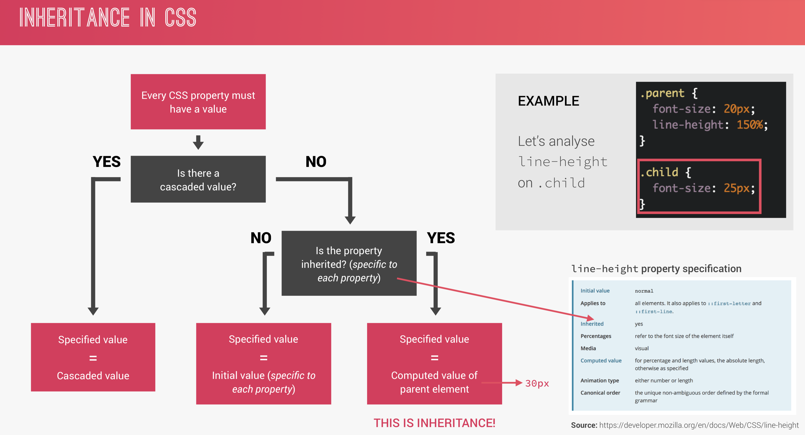
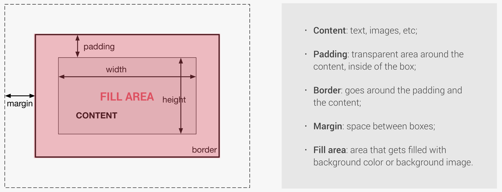
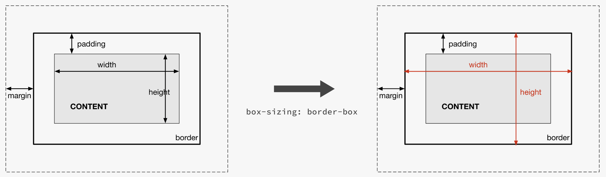
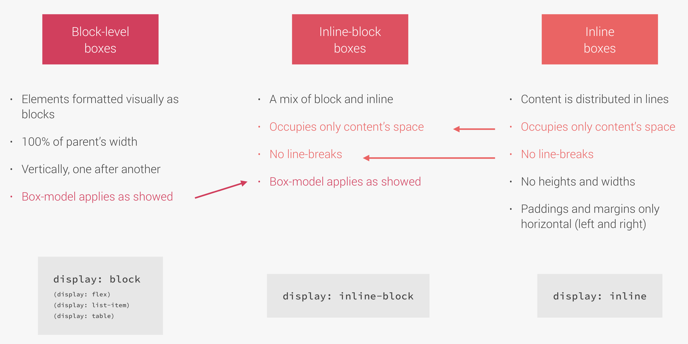

[TOC]


## Section 2: Natours Project (Part 1) 

`background-size: cover;`
And what cover does is that whatever the width of the viewport, or the element, it'll always try to fit the element inside of the box.

`background-position: top;`
Because what it does is to ensure that whatever the viewport size is that this top of the image here always stays at the top of the container.

```
background-image: linear-gradient(
        to right bottom,#7ed56fb4
        ,#28b4859d),
        url(../img/hero.jpg);
```

The linear-gradient() CSS function creates an image consisting of a progressive transition between two or more colors along a straight line. Its result is an object of the <gradient> data type, which is a special kind of <image>.∏

### `clip-path: polygon(0 0 , 100% 0 , 100% 200px, 0 100%);`

The clip-path CSS property creates a clipping region that sets what part of an element should be shown. Parts that are inside the region are shown, while those outside are hidden.

Polygon is the most flexible of all the available shapes because it allows you to specify any amount of points, a little bit like an SVG path. The provided points are pairs of X and Y coordinates that can be of any unit (eg: pixel or percent-based). Because it’s the most flexible, it’s also the most complex and you’ll probably want to use a tool to define your points.

### position

`position:absolute`

`position:relative`

text-transform:uppercase

### block level elements

Because remember that block elements occupy the entire width that they have available. And more importantly for this case, they create line breaks after and before them. And so that's exactly what we want. So a span element is by default, an inline element. So it's just like text. And so we use the display property.

Display, and display it as a block. transform: translateSo we want this middle of the box to be just herewhere now the beginning of the box is. And the same thing applies to the height. So we want this center here of the box,this horizontal center,we want it to be here where the box now begins. So another way,what we want is to translate this entire box. And it's actually pretty easy to do. We just need to use the transform property in CSS. Transform, and translate. Translate. And now we just need to specify how much wewanna translate on x and on epsilon. And what we want is minus 50% for both. And that's it. And that's because these 50% are now no longerin relation to the parent element,but of the element itself. And so if we say we want minus 50%,it will be shifted half of the width to the left side. And the same for the height. So minus 50% says that it will be shifted50% of the element's height to the top.

### transform: translate vs top and left

You can now use these concepts for other things. Because now you totally understand how this worked.

For the Top and Left properties
So again, just to make everything 100% sure. These 40% and these 50%, they are in relation to the parent element.
So 50% of the parent element is where the text box was located to the left side.

Transform: translate
But, on the transform here, when we translated, this is in relation to the element itself.
And this makes it possible that the element is exactly at the center.

### Animations

it's best to only ever animate two different properties.

One is opacity, which is the one that we're using here,

and the other one is the transform property.

That's what the browsers are optimized for,

for these two properties.

### Animation-timing-functions

`animation`
is the shorthand for a number of animation properties

`animation: moveInRight 1s ease-out;`

### `backface-visibility:hidden`

right before the animation ends you will probably

see a little shake here, okay?

So let's take a close look at the end.

no one really knows actually why this happens, but we, actually, we have a fix for this. So there is something that we can do and what we have to do in this case, is to simply declare the backface-visibility property, backface-visibility, and set it to hidden. So the entire heading-primary element because you see actually this entire element is what moves on this animation. So it's a bit shaky, and its the entire heading-primary element. This backface-visibility property determines if the back part of the element when we transform it is visible or hidden for the user.

### Pseudo-Elements and Pseudo-Classes

Pseudo-Classes:
And pseudo-classes are a special state of a selector. So like when a user hovers an element, or when a checkbox is clicked or if we want to select a last-child,
and many other possibilities. So we use pseudo-classes to style elements under a special condition.

---
How to add padding, heights and widths

        So this button here is right now an inline element
        because it's simply text, but we should display it as an inline block. And this way the box model works on this element as if was just a normal block element, okay? So we should always do this if we want to give some paddings or some heights or width to elements, okay?

---

###  `transform: translateY())` - Moving Up and Down the Y Axis
And we want it to move up so we use a negative value
 and that's because in CSS, the upsilon axis moves from the top to the bottom, so it's like from the top to the bottom. And if you want to move up, we have to go the other way around and so it's negative. So to go up, it's a negative value. So negative, minus three pixels in this case.

 ### `transition: all`
 All we have to do is use the transition property,
 transition, now we have to just specify which properties we want to animate. And if we're not really sure, or if we don't want to write them out, we can simply say all. So in this case, all the properties are enabled to be animated.

 #### `transition: all` and Pseudo-Elements
 The `transition: all` property has to be on the initial state

---
 Button click css
 ```
 .btn:link,
.btn:visited {
    text-transform: uppercase;
    text-decoration: none;
    padding: 15px 40px;
    display: inline-block;
    border-radius: 100px;
    transition: all .2s;
}
.btn:hover {
    transform: translateY(-3px);
    box-shadow: 0 10px 20px rgba(0,0,0,.2);
}
.btn:active {
    transform: translateY(-1px);
    box-shadow: 0 5px 10px rgba(0,0,0,.2);    
}
 ```
---

### `::after` Pseudo Element Requirements
First, in order for an after pseudo-element to actually appear on the page, we need to specify **its content property**. So that's always necessary. It doesn't matter what the content is. It can even be empty like we're gonna do here, but we have to specify it. Otherwise it's not going to appear. And the same thing with the display property. So we have to specify the display property.

### setting  height width using `::after`

So we want to have a height of 100%. And we want to have a width of 100% as well. And this works because the after pseudo-element is basically treated like a child of the button. And so if we say that we want the height to be 100%, that's 100% of the width of the button. And so suppose that the button has 100 pixels of height and 50 pixels of width. And so this after pseudo-element will have the exact same dimensions if we set it to 100%.

---

        That's the trick for fading something out, is going to opacity zero

---

### `animation-fill-mode:backwards`
is that it will automatically apply the styles up to zero percent before the animation starts. So, again, these styles will now be applied before the animation starts simply by using the animation fill mode and set it to backwards.

## Section 3: How CSS Works

### Three Pillars of Writing Good HTML and CSS

* Responsive Design -  build one website that works beautifully across all screen sizes on all devices.


        * Fluid layouts
        * Media queries
        * Responsive images
        * Correct units
        * Desktop-first vs mobile-first

* Maintainable and scalable code

        * How to organize files 
        * How to name classes 
        * How to structure HTML

* Web performance - means to make it faster and to make it smaller in size, so that the user has to download less data.

        * Less HTTP requests
        * Less code
        * Compress code
        * Use a CSS preprocessor * Less images
        * Compress images

### How CSS Works Behind the Scenes

#### What happens to CSS when we load up a webpage
1. The browser loads the HTML code and parses it; this process builds the Document Object Model (DOM), which describes the entire web document.
2. Using the links in the HTML header, the browser begins to load and parsed.
   1. First the conflicting CSS declarations are resolved; a process call cascade
   2. The device then calculates percentage and other relative units in the parsing phase.
3. The final CSS is stored in a CSS Object Model (CSSOM);
4. Both the DOM and the CSSOM are stored together to form the Render Tree
5. In order to render the page, the browser uses the Visual Formatting Model, calculates box model, floats, and positioning

### How CSS is Parsed, Part 1: The Cascade and Specificity

CSS Rule - Consists of a Selector and Declaration block. Selector is used to select one or more HTML elements that we want to style. declaration block is where we write the actual styles in order to style elements on our page.  Each declaration consists of a CSS property
and its corresponding value, which is the value that we assign to a property. 

Cascade - Process of combining different stylesheets and resolving conflicts between CSS rules and declaration, when more than one rule applies to a certain element. There are differnt type of CSS:
* Author - CSS written by coder
* User - CSS added in the Dev Tools
* Browser - Default

Importance | Specificity | Source Order
---------- | ----------- | ------------

#### Importance
01. User !important declarations
2232323. Author !important declarations 
77. Author declarations
4. User declarations
52222. Default browser declarations


**Same importance?**

vvvvvvvvv

#### Calculating Specificity

Specificity is calculated in the following rank
1. Inline Styles
2. IDs
3. Classes, pseudo-classes, attribute
4. Elements, pseudo-elements

Each rule is tallies the occurance of item

Example | Inline | IDs | Classes | Elements
------- | ------ | --- | ------- | --------
`#nav a.button:hover` | 0 | 1 | 2 | 1
`nav#nav div.pull-right .button` | 0 | 1 | 2 | 2  

The value of the winning declaration is called the cascaded value,

`nav#nav div.pull-right .button` 

**Same Specificity?**

vvvvvvvvvvvv

The last declaration within the code will override all other declarations and will be applied.

#### Summary
* CSS declarations marked with !important have the highest priority;
* But, only use !important as a last resource. It’s better to use correct specificities more maintainable code!
*  Inline styles will always have priority over styles in external stylesheets; 
* A selector that contains 1 ID is more specific than one with 1000 classes; 
* A selector that contains 1 class is more specific than one with 1000 elements; 
* The universal selector * has no specificity value (0, 0, 0, 0); 
* Rely more on specificity than on the order of selectors; 
* But, rely on order when using 3rd-party stylesheets — always put your author stylesheet last.

### How CSS is Parsed, Part 2: Value Processing

HTML
```
<div class="section">
        <p class="amazing"> CSS is absolutely amazing </p>
</div>
```
CSS
```
   .section {
        font-size: 1.5 rem;
        width: 280px
        background-color: orangered;
   }

   p {
        width: 140px;
        background-color: green;
   }

   .amazing {
        width
   }
```

Step | width (paragraph) | padding (paragraph)  | font-size (root) | font-size (section) | font-size (paragraph)
------- | ------ | --- | ------- | -------- | --
1. Declared value (authored) declarations | 140px | - | - | 1.5rem | -
2. Cascaded value (after the cascade) | 66% | - | 16px (Browser default) | 1.5rem | -
3. Specified value (defaulting, if there is no cascaded value) | 66% | 0px (Initial Value) | 16px | 1.5rem | 24px (inheritance)
4. Computed value (converting relative values to absolute) | 66% | 0px | 16px | 24px (1.5 * 16px) | 24px
5. Used value (final caluclations, based on layout) | 184.8px | 0px | 16px | 24px | 24px
6. Actual value (browser and device restrictions) | 185px | 0px | 16px | 24px | 24px

<br>

<br>

Each and every CSS property needs to have a value even if you don't even declare it at all. that's because each CSS property has something called an "initial value" which is simply the value used if there is no cascaded value. So basically, if we don't declare a value and if neither the browser nor the user define a value, then the initial value will be used. Actually, inheritance also plays a role her

<br>
`rem` unit is always relative to the root font-size,

#### How Units Are Converted From Relative To Absolute (px)

```css
html, body {     
   font-size: 16px;
   width: 80vw;
}

header {
  font-size: 150%; <-- % Font Calculation
  padding: 2em;
  margin-bottom: 10rem; <-- rem Calculation
  height: 90vh;
  width: 1000px;
}

.header-child {
  font-size: 3em;
  padding: 10% <--- % Length Calculation
}
```

  Unit | Example | How to convert to pixels | Result in pixels
 - | ------- | ------------------------ | ----------------
 % (fonts) | 150% |  x% * parent's computed font-size | 24px (150% * 16px ) | 
 % (lengths) | 10% | x% * parent's computed **width** | 100 px ( 10% * 1000px) | 
 em (font) | 3em | x * PARENT computed font-size | 72px (3 * 24) <br> 24 comes from % (fonts) val | 
 em (length) | 2em | x * CURRENT ELEMENT computed font-size | 48px (2 * 24) <br> 24 is inherited from `.header`| 
 rem | 10rem | x * root computed font-size | 160px (10 * 16) | 
 vh | 90vh | x * 1% of viewport height | 90% of the current viewport height| 
 vw | 80vh | x * 1% of viewport width | 80% of the current viewport width| 

<br>

 * And there's a distinction between using percentages for fonts or for length or distance measurements.
 * both ems and rems are font-based, but the difference between them is that `ems` **use the parent or the current element as a reference** while `rems` **use the root font-size as the reference.**
   * For `em`:
     * So for fonts, the reference is the parent.
     * For length, the reference is the current element.
   * For `rem` It actually works the same way for both font sizes and length because it always just uses the root font size as a reference.

### How CSS is Parsed, Part 3: Inheritance



* Inheritance passes the values for some specific properties from parents to children — more maintainable code;
* Properties related to text are inherited: font-family, font-size, color, etc; 
* The computed value of a property is what gets inherited, not the declared value.
* Inheritance of a property only works if no one declares a value for that property;
* The inherit keyword forces inheritance on a certain property;
* The initial keyword resets a property to its initial value.

### Converting px to rem: An Effective Workflow

Why use rem?
> It's because we want an easy way to change all the measurements on our page with one simple setting

So you remember how the rem unit is always in relation to the root font size, right?

So if the root font-size 10px, then 1 rem = 10px

Setting the root font size to  10px is an easy way to calculate rem*, but setting the font size based on percentage is a better pratics. If the default font-size is 16px
    so for 10 px => 62.5% of 16px


Reason why box-sizing was moved from universal selector to the body
> So whenever we can use inheritance, we should use it instead of using here something like the universal selector, and so what I'm going to do now is to remove this box-sizing from here and put it here on the body. So now we set the body to box-sizing border-box, and then in here what we do is to say box-sizing and we use the inherit keyword, and that's it. So remember how we could use the inherit keyword to force inheritance. That's what we're doing here. So the box-sizing property by itself is not inherited, but by setting the box-sizing property on each and every element on the entire page to inherit, it'll automatically inherit whatever we put here on border-box.

 ### How CSS Renders a Website: The Visual Formatting Model

Visual Formating Model - The Algorithm that calculates boxes and determines the layouts of boxes, for each element in the render tree in order to determine the final layout of the page.

The algorithm takes into account the following factor
* Dimensions of boxes: the box model;
* Box type: inline, block and inline-block
* Positioning scheme: floats and positioning;
* Stacking contexts;
* Other elements in the render tree
* Viewport size, dimensions of images, etc;

#### Box Model



total width = right border + right padding + specified width + left padding + left border
total height = top border + top padding + specified height + bottom padding + botton border

example = height = 0 + 20px + 100px + 20px + 0 = 140px

> This means that whenever we define a width or a height of a box, the padding and border get added to what we defined.




To fix the issue of how the height and width are calculated, the `box-sizing` property of the div can be set to `border-box`.

So, if we set box sizing to border box, the height and the width will be defined for the entire box including the padding and the border and not just for the content area. What this means, at the same time is that the paddings and borders that we specify, will of course reduce the inner width of the content area, instead of adding them to the total height or width of an element.

In this case, the actual total width of a box is equal to the specified width. And the same goes for the height. So, if we now define some paddings or borders, they will not get added to the dimensions of the box.

total width =  specified width 
total height =  specified height 

example = height = 100px = 140px

#### Box Types


#### Position


### CSS Architecture, Components and BEM

#### BEM

**B**lock **E**lement **M**odifier
* BLOCK: standalone component that is meaningful on its own. 
* ELEMENT: part of a block that has no standalone meaning. 
* MODIFIER: a different version of a block or an element.

```
.block {}
.block__element {}
.block__element--modifier {}
```

#### The 7-1 Pattern

7 different folder for partial Sass files, and 1 main Sass file toimport all other in a compiled CSS stylesheet.

The 7 Folders:
* base/
* components/
* layout/
* pages/
* themes/
* abstracts/ - where we put code that doesn't output any CSS, such as variables or mix-ins,
* vendor/ - all third party CSS goes.


## Section 4: Introduction to Sass and NPM

### What is SASS

Sass is a CSS preprocessor, an extension of CSS that adds power and elegance to the basic language.

* Variables: for reusable values such as colors, font-sizes, spacing, etc;
* Operators: for mathematical operations right inside of CSS;
* Partials and imports: to write CSS in different files and importing them all into one single file;
* Mixins: to write reusable pieces of CSS code;
* Functions: similar to mixins, with the difference that they produce a value that can than be used; Extends: to make different selectors inherit declarations that are common to all of them;
* Control directives: for writing complex code using conditionals and loops (not covered in this course).

#### First Steps with Sass: Variables and Nesting

That is how SASS identifies variables, always starting with this dollar sign.

` .navigation li {}`

could be written as

```
.navigation { 
   li {

   }
}
```

Also

```
  li {
    display: inline-block;
    margin-left:30px;
  }
  
  li:first-child{
    margin: 0;
  }
```

  can be written as 

  ```
    li {
    display: inline-block;
    margin-left:30px;
  
        &:first-child{
        margin: 0;
        }
    }
  ```
  Where the `&` writes the selector path up until that point.

Without the ampersand, the css would be compiled as `li :first-child`

Note:

> When all child elements of a component are floating, the element collapses and loses its heigth,

To fix this issue add

```
&::after {
  content: "";
  clear: both; <--- This is important
  display:table;
}
```

There is a SASS color function that is used to make colors darker

`background-color:darken($color-var,15%)`


Final SASS Vs CSS

##### SASS
```scss
* {
  margin: 0;
  padding: 0;
}

$color-primary: #f9ed69; //yellow color
$color-secondary: #f08a5d; //orange
$color-tertiary: #b83b5e; //pink
$color-text-dark: #333;
$color-text-light: #eee;


$width-button:150px;

nav {
  margin: 30px;
  background-color: $color-primary;

  &::after {
    content: "";
    clear: both;
    display: table;
  }
}

.navigation {
  list-style: none;
  float: left;
  li {
    display: inline-block;
    margin-left: 30px;

    &:first-child {
      margin: 0;
    }

    a:link {
      text-transform: uppercase;
      text-decoration: none;
      color: $color-text-dark;
    }
  }
}

.buttons {
  float: right;
}

.btn-main:link,
.btn-hot:link{
  padding:10px;
  display:inline-block;
  text-align: center;
  border-radius: 100px;
  text-decoration: none;
  text-transform: uppercase;
  width: $width-button;
  color:$color-text-light;
}

.btn-main {
  &:link {
    background-color: $color-secondary;
  }
  
  &:hover {
    background-color: darken($color-secondary, 15%)
  }
}

.btn-hot {
  &:link {
    background-color: $color-tertiary;
  }
  
  &:hover {
    background-color: darken($color-tertiary, 15%)
  }
}
```
---
##### Compiled CSS
```css
* {
  margin: 0;
  padding: 0;
}

nav {
  margin: 30px;
  background-color: #f9ed69;
}
nav::after {
  content: "";
  clear: both;
  display: table;
}

.navigation {
  list-style: none;
  float: left;
}
.navigation li {
  display: inline-block;
  margin-left: 30px;
}
.navigation li:first-child {
  margin: 0;
}
.navigation li a:link {
  text-transform: uppercase;
  text-decoration: none;
  color: #333;
}

.buttons {
  float: right;
}

.btn-main:link,
.btn-hot:link {
  padding: 10px;
  display: inline-block;
  text-align: center;
  border-radius: 100px;
  text-decoration: none;
  text-transform: uppercase;
  width: 150px;
  color: #eee;
}

.btn-main:link {
  background-color: #f08a5d;
}
.btn-main:hover {
  background-color: #ea5717;
}

.btn-hot:link {
  background-color: #b83b5e;
}
.btn-hot:hover {
  background-color: #7e2840;
}
```


#### First Steps with Sass: Mixins, Extends and Functions

What is a Mixin?

A Mixing is a reusable piece of SASS code that be used anywhere within the code

`@mixin` is the keyword used to declare a mixin

`@include` is the keyword used to use the mixin later in the code


```@mixin clearfix {
  &::after {
    content: "";
    clear: both;
    display: table;
  }
}
```
Ex:   `@include clearfix;`

Mixins can have arguments as well

```
@mixin style-link-text($color) {
  text-transform: uppercase;
  width: $width-button;
  color: $color;
}
```

What is a function?

A Function is also a reuable piece of SASS code, but one that used for calculations


What is extends?

Extends are Basically a placeholder where a bunch of styles coexist and can be used by other elements by extending that place holder.

To create a Extend, use the % symbol

Ex %btn-placeholder

The difference between a Mixin and Extends

The biggest difference between a Mixin and Extends is that when using the Mixin, the code from the mixin is copied to the selctor that is using the Mixin. On the other hand, when using extends, **the selector that is using the Extends is copied to the rule**

From: [When to user extend; When to use a Mixin](https://csswizardry.com/2014/11/when-to-use-extend-when-to-use-a-mixin/)
>It is important to realise that @extend creates relationships. Whenever you use @extend, you are transplanting a selector elsewhere in your stylesheet in order for it to share traits with other selectors that are also being transplanted. As a result, you are dictating that these selectors all share a relationship, and misusing @extend can create relationships around the wrong criterion. It would be like grouping your CD collection by the colour of their covers: doable, but not a useful relationship to create.

Final SASS Vs CSS

##### SASS
```scss
* {
  margin: 0;
  padding: 0;
}

$color-primary: #f9ed69; //yellow color
$color-secondary: #f08a5d; //orange
$color-tertiary: #b83b5e; //pink
$color-text-dark: #333;
$color-text-light: #eee;

$width-button: 150px;

@mixin clearfix {
  &::after {
    content: "";
    clear: both;
    display: table;
  }
}

@mixin style-link-text($color) {
  text-transform: uppercase;
  width: $width-button;
  color: $color;
}

nav {
  margin: 30px;
  background-color: $color-primary;

  @include clearfix;
}

.navigation {
  list-style: none;
  float: left;
  li {
    display: inline-block;
    margin-left: 30px;

    &:first-child {
      margin: 0;
    }

    a:link {
      text-transform: uppercase;
      text-decoration: none;
      color: $color-text-dark;
    }
  }
}

.buttons {
  float: right;
}

%btn-placeholder {
  padding: 10px;
  display: inline-block;
  text-align: center;
  border-radius: 100px;
  text-decoration: none;
  @include style-link-text($color-text-light);
}

.btn-main {
  &:link {
    @extend %btn-placeholder; <-- Uses Extends
    background-color: $color-secondary;
  }

  &:hover {
    background-color: darken($color-secondary, 15%);
  }
}

.btn-hot {
  &:link {
    @extend %btn-placeholder; <-- Uses Extend
    background-color: $color-tertiary;
  }

  &:hover {
    background-color: darken($color-tertiary, 15%);
  }
}
```

Final Compiled CSS 
```CSS
* {
  margin: 0;
  padding: 0;
}

nav {
  margin: 30px;
  background-color: #f9ed69;
}
nav::after {
  content: "";
  clear: both;
  display: table;
}

.navigation {
  list-style: none;
  float: left;
}
.navigation li {
  display: inline-block;
  margin-left: 30px;
}
.navigation li:first-child {
  margin: 0;
}
.navigation li a:link {
  text-transform: uppercase;
  text-decoration: none;
  color: #333;
}

.buttons {
  float: right;
}

.btn-main:link, .btn-hot:link {  <--- Note that the two selectors that used the %btn-placeholder were copied to the rule itself
  padding: 10px;
  display: inline-block;
  text-align: center;
  border-radius: 100px;
  text-decoration: none;
  text-transform: uppercase;
  width: 150px;
  color: #eee;
}

.btn-main:link {
  background-color: #f08a5d;
}
.btn-main:hover {
  background-color: #ea5717;
}

.btn-hot:link {
  background-color: #b83b5e;
}
.btn-hot:hover {
  background-color: #7e2840;
}
```

#### A Brief Intro to the Command Line (Skipped)

#### NPM Packages: Let's Install Sass Locally (Skipped)

#### NPM Scripts: Let's Write and Compile Sass Locally

##### Sass actually supports two syntaxes  which can be specified using the proper file extension:

* SCSS

  The SCSS syntax uses the file extension `.scss`. With a few small exceptions, it’s a superset of CSS, which means essentially **all valid CSS is valid SCSS as well**. Because of its similarity to CSS, it’s the easiest syntax to get used to and the most popular.

* The Indented Syntax

  The indented syntax was Sass’s original syntax, and so it uses the file extension `.sass`. Because of this extension, it’s sometimes just called “Sass”. The indented syntax supports all the same features as SCSS, but it uses indentation instead of curly braces and semicolons to describe the format of the document.

  In general, any time you’d write curly braces in CSS or SCSS, you can just indent one level deeper in the indented syntax. And any time a line ends, that counts as a semicolon. There are also a few additional differences in the indented syntax that are noted throughout the reference.

When writing SCSS code, it eventually needs to be compiled. As a workaround, a **node-sass** has a 'watch' feature that looks for live changes and recompile the scss into css.

```json
"scripts": {
  "compile:sass": "node-sass sass/main.scss css/style.css -w"
}
```

To run in the cmd line:

`npm run compile:sass`

####  The Easiest Way of Automatically Reloading a Page on File Changes (Skipped)