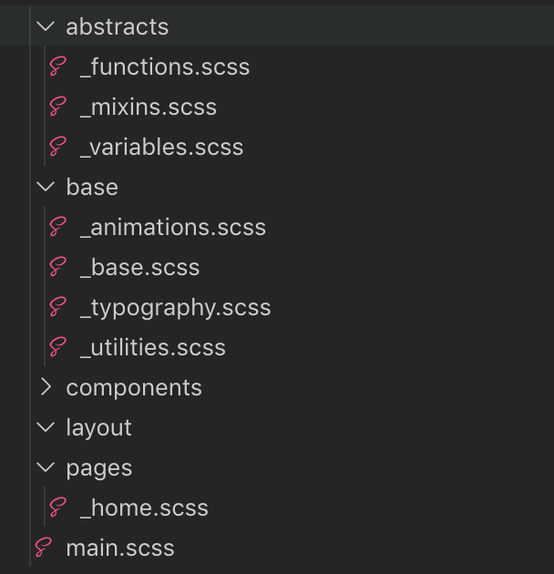
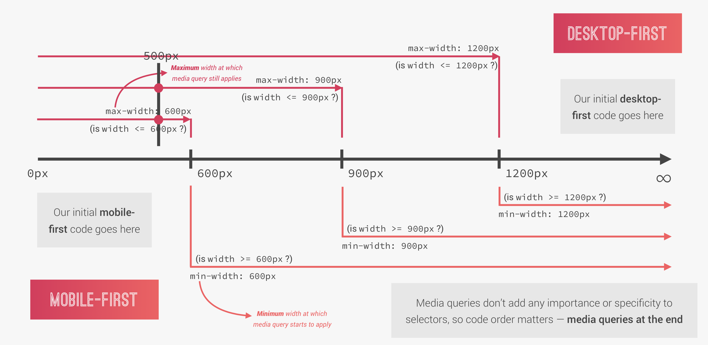
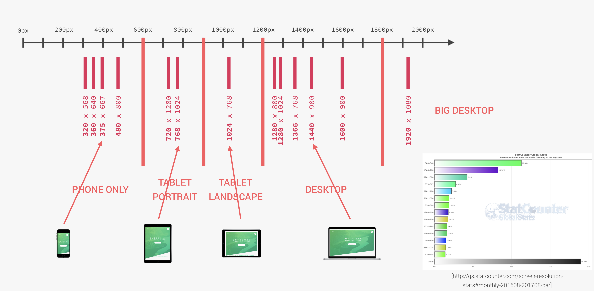
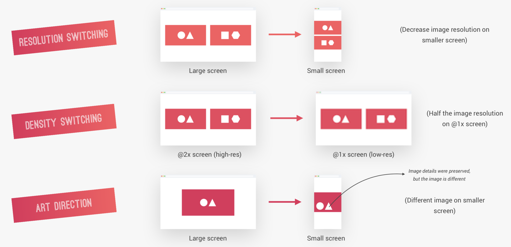
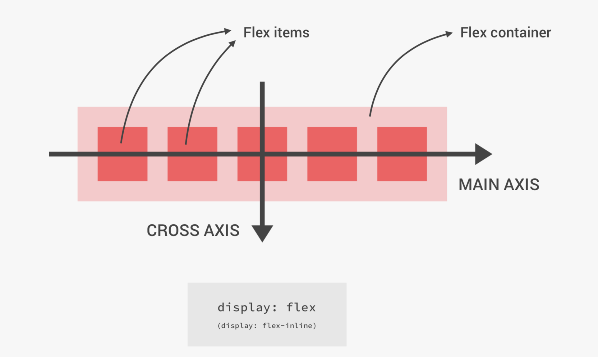
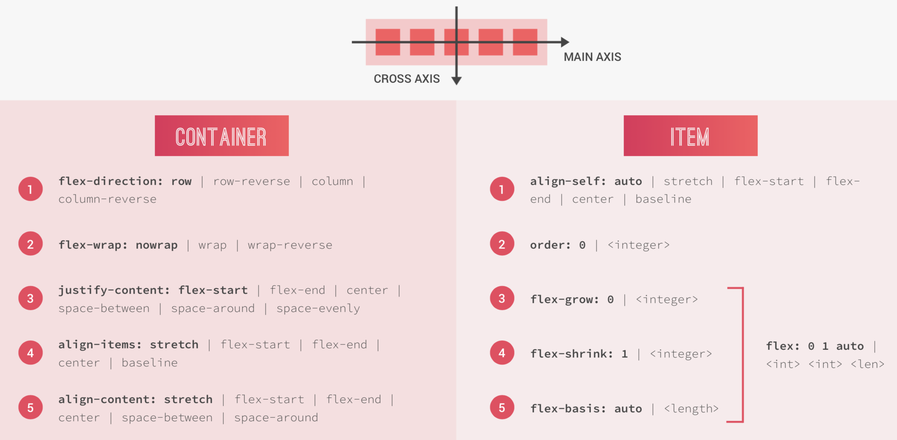
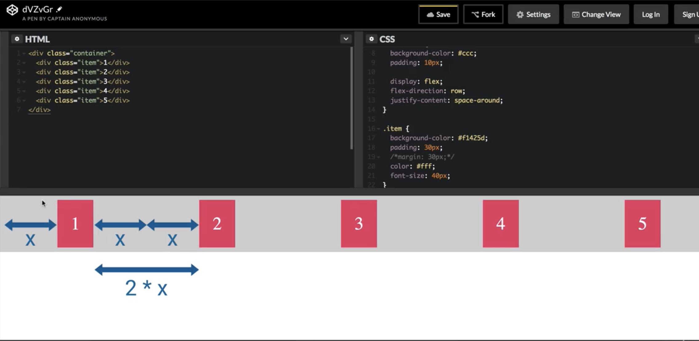
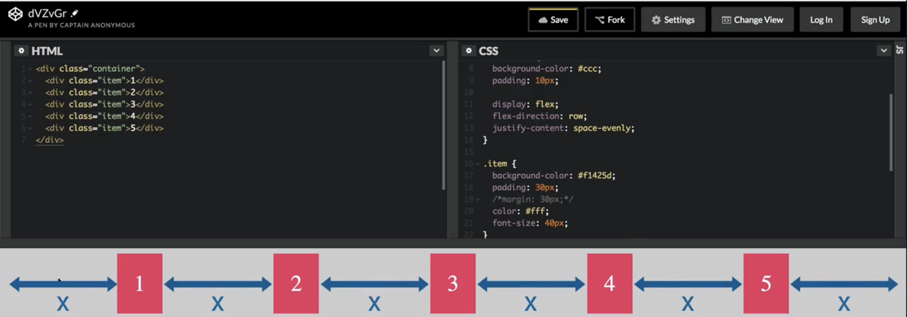
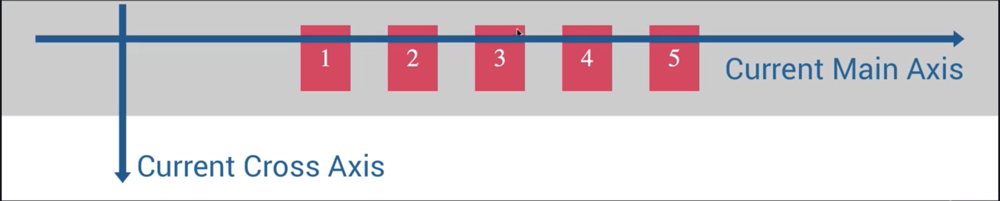
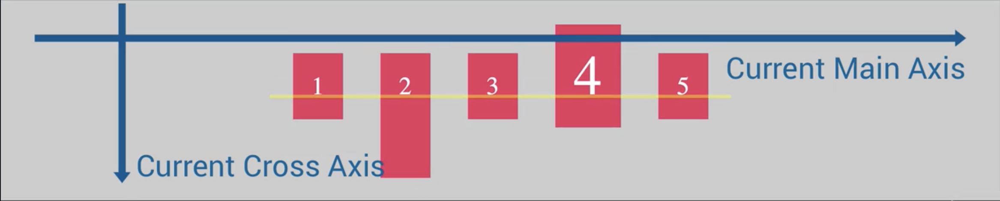

[TOC]


## Section 2: Natours Project (Part 1)

`background-size: cover;`
And what cover does is that whatever the width of the viewport, or the element, it'll always try to fit the element inside of the box.

`background-position: top;`
Because what it does is to ensure that whatever the viewport size is that this top of the image here always stays at the top of the container.

```
background-image: linear-gradient(
        to right bottom,#7ed56fb4
        ,#28b4859d),
        url(../img/hero.jpg);
```

The linear-gradient() CSS function creates an image consisting of a progressive transition between two or more colors along a straight line. Its result is an object of the <gradient> data type, which is a special kind of <image>.∏

### `clip-path: polygon(0 0 , 100% 0 , 100% 200px, 0 100%);`

The clip-path CSS property creates a clipping region that sets what part of an element should be shown. Parts that are inside the region are shown, while those outside are hidden.

Polygon is the most flexible of all the available shapes because it allows you to specify any amount of points, a little bit like an SVG path. The provided points are pairs of X and Y coordinates that can be of any unit (eg: pixel or percent-based). Because it’s the most flexible, it’s also the most complex and you’ll probably want to use a tool to define your points.

### position

`position:absolute`

`position:relative`

text-transform:uppercase

### block level elements

Because remember that block elements occupy the entire width that they have available. And more importantly for this case, they create line breaks after and before them. And so that's exactly what we want. So a span element is by default, an inline element. So it's just like text. And so we use the display property.

Display, and display it as a block. transform: translateSo we want this middle of the box to be just herewhere now the beginning of the box is. And the same thing applies to the height. So we want this center here of the box,this horizontal center,we want it to be here where the box now begins. So another way,what we want is to translate this entire box. And it's actually pretty easy to do. We just need to use the transform property in CSS. Transform, and translate. Translate. And now we just need to specify how much wewanna translate on x and on epsilon. And what we want is minus 50% for both. And that's it. And that's because these 50% are now no longerin relation to the parent element,but of the element itself. And so if we say we want minus 50%,it will be shifted half of the width to the left side. And the same for the height. So minus 50% says that it will be shifted50% of the element's height to the top.

### transform: translate vs top and left

You can now use these concepts for other things. Because now you totally understand how this worked.

For the Top and Left properties
So again, just to make everything 100% sure. These 40% and these 50%, they are in relation to the parent element.
So 50% of the parent element is where the text box was located to the left side.

Transform: translate
But, on the transform here, when we translated, this is in relation to the element itself.
And this makes it possible that the element is exactly at the center.

### Animations

it's best to only ever animate two different properties.

One is opacity, which is the one that we're using here,

and the other one is the transform property.

That's what the browsers are optimized for,

for these two properties.

### Animation-timing-functions

`animation`
is the shorthand for a number of animation properties

`animation: moveInRight 1s ease-out;`

### `backface-visibility:hidden`

right before the animation ends you will probably

see a little shake here, okay?

So let's take a close look at the end.

no one really knows actually why this happens, but we, actually, we have a fix for this. So there is something that we can do and what we have to do in this case, is to simply declare the backface-visibility property, backface-visibility, and set it to hidden. So the entire heading-primary element because you see actually this entire element is what moves on this animation. So it's a bit shaky, and its the entire heading-primary element. This backface-visibility property determines if the back part of the element when we transform it is visible or hidden for the user.

### Pseudo-Elements and Pseudo-Classes

Pseudo-Classes:
And pseudo-classes are a special state of a selector. So like when a user hovers an element, or when a checkbox is clicked or if we want to select a last-child,
and many other possibilities. So we use pseudo-classes to style elements under a special condition.

---
How to add padding, heights and widths

        So this button here is right now an inline element
        because it's simply text, but we should display it as an inline block. And this way the box model works on this element as if was just a normal block element, okay? So we should always do this if we want to give some paddings or some heights or width to elements, okay?

---

###  `transform: translateY())` - Moving Up and Down the Y Axis
And we want it to move up so we use a negative value
 and that's because in CSS, the upsilon axis moves from the top to the bottom, so it's like from the top to the bottom. And if you want to move up, we have to go the other way around and so it's negative. So to go up, it's a negative value. So negative, minus three pixels in this case.

 ### `transition: all`
 All we have to do is use the transition property,
 transition, now we have to just specify which properties we want to animate. And if we're not really sure, or if we don't want to write them out, we can simply say all. So in this case, all the properties are enabled to be animated.

 #### `transition: all` and Pseudo-Elements
 The `transition: all` property has to be on the initial state

---
 Button click css
 ```
 .btn:link,
.btn:visited {
    text-transform: uppercase;
    text-decoration: none;
    padding: 15px 40px;
    display: inline-block;
    border-radius: 100px;
    transition: all .2s;
}
.btn:hover {
    transform: translateY(-3px);
    box-shadow: 0 10px 20px rgba(0,0,0,.2);
}
.btn:active {
    transform: translateY(-1px);
    box-shadow: 0 5px 10px rgba(0,0,0,.2);    
}
 ```
---

### `::after` Pseudo Element Requirements
First, in order for an after pseudo-element to actually appear on the page, we need to specify **its content property**. So that's always necessary. It doesn't matter what the content is. It can even be empty like we're gonna do here, but we have to specify it. Otherwise it's not going to appear. And the same thing with the display property. So we have to specify the display property.

### setting  height width using `::after`

So we want to have a height of 100%. And we want to have a width of 100% as well. And this works because the after pseudo-element is basically treated like a child of the button. And so if we say that we want the height to be 100%, that's 100% of the width of the button. And so suppose that the button has 100 pixels of height and 50 pixels of width. And so this after pseudo-element will have the exact same dimensions if we set it to 100%.

---

        That's the trick for fading something out, is going to opacity zero

---

### `animation-fill-mode:backwards`
is that it will automatically apply the styles up to zero percent before the animation starts. So, again, these styles will now be applied before the animation starts simply by using the animation fill mode and set it to backwards.

## Section 3: How CSS Works

### Three Pillars of Writing Good HTML and CSS

* Responsive Design -  build one website that works beautifully across all screen sizes on all devices.


        * Fluid layouts
        * Media queries
        * Responsive images
        * Correct units
        * Desktop-first vs mobile-first

* Maintainable and scalable code

        * How to organize files 
        * How to name classes 
        * How to structure HTML

* Web performance - means to make it faster and to make it smaller in size, so that the user has to download less data.

        * Less HTTP requests
        * Less code
        * Compress code
        * Use a CSS preprocessor * Less images
        * Compress images

### How CSS Works Behind the Scenes

#### What happens to CSS when we load up a webpage
1. The browser loads the HTML code and parses it; this process builds the Document Object Model (DOM), which describes the entire web document.
2. Using the links in the HTML header, the browser begins to load and parsed.
   1. First the conflicting CSS declarations are resolved; a process call cascade
   2. The device then calculates percentage and other relative units in the parsing phase.
3. The final CSS is stored in a CSS Object Model (CSSOM);
4. Both the DOM and the CSSOM are stored together to form the Render Tree
5. In order to render the page, the browser uses the Visual Formatting Model, calculates box model, floats, and positioning

### How CSS is Parsed, Part 1: The Cascade and Specificity

CSS Rule - Consists of a Selector and Declaration block. Selector is used to select one or more HTML elements that we want to style. declaration block is where we write the actual styles in order to style elements on our page.  Each declaration consists of a CSS property
and its corresponding value, which is the value that we assign to a property. 

Cascade - Process of combining different stylesheets and resolving conflicts between CSS rules and declaration, when more than one rule applies to a certain element. There are differnt type of CSS:
* Author - CSS written by coder
* User - CSS added in the Dev Tools
* Browser - Default

Importance | Specificity | Source Order
---------- | ----------- | ------------

#### Importance
01. User !important declarations
2232323. Author !important declarations 
77. Author declarations
4. User declarations
52222. Default browser declarations


**Same importance?**

vvvvvvvvv

#### Calculating Specificity

Specificity is calculated in the following rank
1. Inline Styles
2. IDs
3. Classes, pseudo-classes, attribute
4. Elements, pseudo-elements

Each rule is tallies the occurance of item

Example | Inline | IDs | Classes | Elements
------- | ------ | --- | ------- | --------
`#nav a.button:hover` | 0 | 1 | 2 | 1
`nav#nav div.pull-right .button` | 0 | 1 | 2 | 2  

The value of the winning declaration is called the cascaded value,

`nav#nav div.pull-right .button` 

**Same Specificity?**

vvvvvvvvvvvv

The last declaration within the code will override all other declarations and will be applied.

#### Summary
* CSS declarations marked with !important have the highest priority;
* But, only use !important as a last resource. It’s better to use correct specificities more maintainable code!
*  Inline styles will always have priority over styles in external stylesheets; 
* A selector that contains 1 ID is more specific than one with 1000 classes; 
* A selector that contains 1 class is more specific than one with 1000 elements; 
* The universal selector * has no specificity value (0, 0, 0, 0); 
* Rely more on specificity than on the order of selectors; 
* But, rely on order when using 3rd-party stylesheets — always put your author stylesheet last.

### How CSS is Parsed, Part 2: Value Processing

HTML
```
<div class="section">
        <p class="amazing"> CSS is absolutely amazing </p>
</div>
```
CSS
```
   .section {
        font-size: 1.5 rem;
        width: 280px
        background-color: orangered;
   }

   p {
        width: 140px;
        background-color: green;
   }

   .amazing {
        width
   }
```

Step | width (paragraph) | padding (paragraph)  | font-size (root) | font-size (section) | font-size (paragraph)
------- | ------ | --- | ------- | -------- | --
1. Declared value (authored) declarations | 140px | - | - | 1.5rem | -
2. Cascaded value (after the cascade) | 66% | - | 16px (Browser default) | 1.5rem | -
3. Specified value (defaulting, if there is no cascaded value) | 66% | 0px (Initial Value) | 16px | 1.5rem | 24px (inheritance)
4. Computed value (converting relative values to absolute) | 66% | 0px | 16px | 24px (1.5 * 16px) | 24px
5. Used value (final caluclations, based on layout) | 184.8px | 0px | 16px | 24px | 24px
6. Actual value (browser and device restrictions) | 185px | 0px | 16px | 24px | 24px

<br>

<br>

Each and every CSS property needs to have a value even if you don't even declare it at all. that's because each CSS property has something called an "initial value" which is simply the value used if there is no cascaded value. So basically, if we don't declare a value and if neither the browser nor the user define a value, then the initial value will be used. Actually, inheritance also plays a role her

<br>
`rem` unit is always relative to the root font-size,

#### How Units Are Converted From Relative To Absolute (px)

```css
html, body {     
   font-size: 16px;
   width: 80vw;
}

header {
  font-size: 150%; <-- % Font Calculation
  padding: 2em;
  margin-bottom: 10rem; <-- rem Calculation
  height: 90vh;
  width: 1000px;
}

.header-child {
  font-size: 3em;
  padding: 10% <--- % Length Calculation
}
```

  Unit | Example | How to convert to pixels | Result in pixels
 - | ------- | ------------------------ | ----------------
 % (fonts) | 150% |  x% * parent's computed font-size | 24px (150% * 16px ) | 
 % (lengths) | 10% | x% * parent's computed **width** | 100 px ( 10% * 1000px) | 
 em (font) | 3em | x * PARENT computed font-size | 72px (3 * 24) <br> 24 comes from % (fonts) val | 
 em (length) | 2em | x * CURRENT ELEMENT computed font-size | 48px (2 * 24) <br> 24 is inherited from `.header`| 
 rem | 10rem | x * root computed font-size | 160px (10 * 16) | 
 vh | 90vh | x * 1% of viewport height | 90% of the current viewport height| 
 vw | 80vh | x * 1% of viewport width | 80% of the current viewport width| 

<br>

 * And there's a distinction between using percentages for fonts or for length or distance measurements.
 * both ems and rems are font-based, but the difference between them is that `ems` **use the parent or the current element as a reference** while `rems` **use the root font-size as the reference.**
   * For `em`:
     * So for fonts, the reference is the parent.
     * For length, the reference is the current element.
   * For `rem` It actually works the same way for both font sizes and length because it always just uses the root font size as a reference.

### How CSS is Parsed, Part 3: Inheritance


* Inheritance passes the values for some specific properties from parents to children — more maintainable code;
* Properties related to text are inherited: font-family, font-size, color, etc; 
* The computed value of a property is what gets inherited, not the declared value.
* Inheritance of a property only works if no one declares a value for that property;
* The inherit keyword forces inheritance on a certain property;
* The initial keyword resets a property to its initial value.

### Converting px to rem: An Effective Workflow

Why use rem?
> It's because we want an easy way to change all the measurements on our page with one simple setting

So you remember how the rem unit is always in relation to the root font size, right?

So if the root font-size 10px, then 1 rem = 10px

Setting the root font size to  10px is an easy way to calculate rem*, but setting the font size based on percentage is a better pratics. If the default font-size is 16px
    so for 10 px => 62.5% of 16px


Reason why box-sizing was moved from universal selector to the body
> So whenever we can use inheritance, we should use it instead of using here something like the universal selector, and so what I'm going to do now is to remove this box-sizing from here and put it here on the body. So now we set the body to box-sizing border-box, and then in here what we do is to say box-sizing and we use the inherit keyword, and that's it. So remember how we could use the inherit keyword to force inheritance. That's what we're doing here. So the box-sizing property by itself is not inherited, but by setting the box-sizing property on each and every element on the entire page to inherit, it'll automatically inherit whatever we put here on border-box.

 ### How CSS Renders a Website: The Visual Formatting Model

Visual Formating Model - The Algorithm that calculates boxes and determines the layouts of boxes, for each element in the render tree in order to determine the final layout of the page.

The algorithm takes into account the following factor
* Dimensions of boxes: the box model;
* Box type: inline, block and inline-block
* Positioning scheme: floats and positioning;
* Stacking contexts;
* Other elements in the render tree
* Viewport size, dimensions of images, etc;

#### Box Model


total width = right border + right padding + specified width + left padding + left border
total height = top border + top padding + specified height + bottom padding + botton border

example = height = 0 + 20px + 100px + 20px + 0 = 140px

> This means that whenever we define a width or a height of a box, the padding and border get added to what we defined.


To fix the issue of how the height and width are calculated, the `box-sizing` property of the div can be set to `border-box`.

So, if we set box sizing to border box, the height and the width will be defined for the entire box including the padding and the border and not just for the content area. What this means, at the same time is that the paddings and borders that we specify, will of course reduce the inner width of the content area, instead of adding them to the total height or width of an element.

In this case, the actual total width of a box is equal to the specified width. And the same goes for the height. So, if we now define some paddings or borders, they will not get added to the dimensions of the box.

total width =  specified width 
total height =  specified height 

example = height = 100px = 140px

#### Box Types


#### Position


### CSS Architecture, Components and BEM

#### BEM

**B**lock **E**lement **M**odifier
* BLOCK: standalone component that is meaningful on its own. 
* ELEMENT: part of a block that has no standalone meaning. 
* MODIFIER: a different version of a block or an element.

```
.block {}
.block__element {}
.block__element--modifier {}
```

#### The 7-1 Pattern

7 different folder for partial Sass files, and 1 main Sass file toimport all other in a compiled CSS stylesheet.

The 7 Folders:
* base/
* components/
* layout/
* pages/
* themes/
* abstracts/ - where we put code that doesn't output any CSS, such as variables or mix-ins,
* vendor/ - all third party CSS goes.


## Section 4: Introduction to Sass and NPM

### What is SASS

Sass is a CSS preprocessor, an extension of CSS that adds power and elegance to the basic language.

* Variables: for reusable values such as colors, font-sizes, spacing, etc;
* Operators: for mathematical operations right inside of CSS;
* Partials and imports: to write CSS in different files and importing them all into one single file;
* Mixins: to write reusable pieces of CSS code;
* Functions: similar to mixins, with the difference that they produce a value that can than be used; Extends: to make different selectors inherit declarations that are common to all of them;
* Control directives: for writing complex code using conditionals and loops (not covered in this course).

#### First Steps with Sass: Variables and Nesting

That is how SASS identifies variables, always starting with this dollar sign.

` .navigation li {}`

could be written as

```
.navigation { 
   li {

   }
}
```

Also

```
  li {
    display: inline-block;
    margin-left:30px;
  }
  
  li:first-child{
    margin: 0;
  }
```

  can be written as 

  ```
    li {
    display: inline-block;
    margin-left:30px;
  
        &:first-child{
        margin: 0;
        }
    }
  ```
  Where the `&` writes the selector path up until that point.

Without the ampersand, the css would be compiled as `li :first-child`

Note:

> When all child elements of a component are floating, the element collapses and loses its heigth,

To fix this issue add

```
&::after {
  content: "";
  clear: both; <--- This is important
  display:table;
}
```

There is a SASS color function that is used to make colors darker

`background-color:darken($color-var,15%)`


Final SASS Vs CSS

##### SASS
```scss
* {
  margin: 0;
  padding: 0;
}

$color-primary: #f9ed69; //yellow color
$color-secondary: #f08a5d; //orange
$color-tertiary: #b83b5e; //pink
$color-text-dark: #333;
$color-text-light: #eee;


$width-button:150px;

nav {
  margin: 30px;
  background-color: $color-primary;

  &::after {
    content: "";
    clear: both;
    display: table;
  }
}

.navigation {
  list-style: none;
  float: left;
  li {
    display: inline-block;
    margin-left: 30px;

    &:first-child {
      margin: 0;
    }

    a:link {
      text-transform: uppercase;
      text-decoration: none;
      color: $color-text-dark;
    }
  }
}

.buttons {
  float: right;
}

.btn-main:link,
.btn-hot:link{
  padding:10px;
  display:inline-block;
  text-align: center;
  border-radius: 100px;
  text-decoration: none;
  text-transform: uppercase;
  width: $width-button;
  color:$color-text-light;
}

.btn-main {
  &:link {
    background-color: $color-secondary;
  }
  
  &:hover {
    background-color: darken($color-secondary, 15%)
  }
}

.btn-hot {
  &:link {
    background-color: $color-tertiary;
  }
  
  &:hover {
    background-color: darken($color-tertiary, 15%)
  }
}
```
---
##### Compiled CSS
```css
* {
  margin: 0;
  padding: 0;
}

nav {
  margin: 30px;
  background-color: #f9ed69;
}
nav::after {
  content: "";
  clear: both;
  display: table;
}

.navigation {
  list-style: none;
  float: left;
}
.navigation li {
  display: inline-block;
  margin-left: 30px;
}
.navigation li:first-child {
  margin: 0;
}
.navigation li a:link {
  text-transform: uppercase;
  text-decoration: none;
  color: #333;
}

.buttons {
  float: right;
}

.btn-main:link,
.btn-hot:link {
  padding: 10px;
  display: inline-block;
  text-align: center;
  border-radius: 100px;
  text-decoration: none;
  text-transform: uppercase;
  width: 150px;
  color: #eee;
}

.btn-main:link {
  background-color: #f08a5d;
}
.btn-main:hover {
  background-color: #ea5717;
}

.btn-hot:link {
  background-color: #b83b5e;
}
.btn-hot:hover {
  background-color: #7e2840;
}
```


#### First Steps with Sass: Mixins, Extends and Functions

What is a Mixin?

A Mixing is a reusable piece of SASS code that be used anywhere within the code

`@mixin` is the keyword used to declare a mixin

`@include` is the keyword used to use the mixin later in the code


```@mixin clearfix {
  &::after {
    content: "";
    clear: both;
    display: table;
  }
}
```
Ex:   `@include clearfix;`

Mixins can have arguments as well

```
@mixin style-link-text($color) {
  text-transform: uppercase;
  width: $width-button;
  color: $color;
}
```

What is a function?

A Function is also a reuable piece of SASS code, but one that used for calculations


What is extends?

Extends are Basically a placeholder where a bunch of styles coexist and can be used by other elements by extending that place holder.

To create a Extend, use the % symbol

Ex %btn-placeholder

The difference between a Mixin and Extends

The biggest difference between a Mixin and Extends is that when using the Mixin, the code from the mixin is copied to the selctor that is using the Mixin. On the other hand, when using extends, **the selector that is using the Extends is copied to the rule**

From: [When to user extend; When to use a Mixin](https://csswizardry.com/2014/11/when-to-use-extend-when-to-use-a-mixin/)
>It is important to realise that @extend creates relationships. Whenever you use @extend, you are transplanting a selector elsewhere in your stylesheet in order for it to share traits with other selectors that are also being transplanted. As a result, you are dictating that these selectors all share a relationship, and misusing @extend can create relationships around the wrong criterion. It would be like grouping your CD collection by the colour of their covers: doable, but not a useful relationship to create.

Final SASS Vs CSS

##### SASS
```scss
* {
  margin: 0;
  padding: 0;
}

$color-primary: #f9ed69; //yellow color
$color-secondary: #f08a5d; //orange
$color-tertiary: #b83b5e; //pink
$color-text-dark: #333;
$color-text-light: #eee;

$width-button: 150px;

@mixin clearfix {
  &::after {
    content: "";
    clear: both;
    display: table;
  }
}

@mixin style-link-text($color) {
  text-transform: uppercase;
  width: $width-button;
  color: $color;
}

nav {
  margin: 30px;
  background-color: $color-primary;

  @include clearfix;
}

.navigation {
  list-style: none;
  float: left;
  li {
    display: inline-block;
    margin-left: 30px;

    &:first-child {
      margin: 0;
    }

    a:link {
      text-transform: uppercase;
      text-decoration: none;
      color: $color-text-dark;
    }
  }
}

.buttons {
  float: right;
}

%btn-placeholder {
  padding: 10px;
  display: inline-block;
  text-align: center;
  border-radius: 100px;
  text-decoration: none;
  @include style-link-text($color-text-light);
}

.btn-main {
  &:link {
    @extend %btn-placeholder; <-- Uses Extends
    background-color: $color-secondary;
  }

  &:hover {
    background-color: darken($color-secondary, 15%);
  }
}

.btn-hot {
  &:link {
    @extend %btn-placeholder; <-- Uses Extend
    background-color: $color-tertiary;
  }

  &:hover {
    background-color: darken($color-tertiary, 15%);
  }
}
```

Final Compiled CSS 
```CSS
* {
  margin: 0;
  padding: 0;
}

nav {
  margin: 30px;
  background-color: #f9ed69;
}
nav::after {
  content: "";
  clear: both;
  display: table;
}

.navigation {
  list-style: none;
  float: left;
}
.navigation li {
  display: inline-block;
  margin-left: 30px;
}
.navigation li:first-child {
  margin: 0;
}
.navigation li a:link {
  text-transform: uppercase;
  text-decoration: none;
  color: #333;
}

.buttons {
  float: right;
}

.btn-main:link, .btn-hot:link {  <--- Note that the two selectors that used the %btn-placeholder were copied to the rule itself
  padding: 10px;
  display: inline-block;
  text-align: center;
  border-radius: 100px;
  text-decoration: none;
  text-transform: uppercase;
  width: 150px;
  color: #eee;
}

.btn-main:link {
  background-color: #f08a5d;
}
.btn-main:hover {
  background-color: #ea5717;
}

.btn-hot:link {
  background-color: #b83b5e;
}
.btn-hot:hover {
  background-color: #7e2840;
}
```

#### A Brief Intro to the Command Line (Skipped)

#### NPM Packages: Let's Install Sass Locally (Skipped)

#### NPM Scripts: Let's Write and Compile Sass Locally

##### Sass actually supports two syntaxes  which can be specified using the proper file extension:

* SCSS

  The SCSS syntax uses the file extension `.scss`. With a few small exceptions, it’s a superset of CSS, which means essentially **all valid CSS is valid SCSS as well**. Because of its similarity to CSS, it’s the easiest syntax to get used to and the most popular.

* The Indented Syntax

  The indented syntax was Sass’s original syntax, and so it uses the file extension `.sass`. Because of this extension, it’s sometimes just called “Sass”. The indented syntax supports all the same features as SCSS, but it uses indentation instead of curly braces and semicolons to describe the format of the document.

  In general, any time you’d write curly braces in CSS or SCSS, you can just indent one level deeper in the indented syntax. And any time a line ends, that counts as a semicolon. There are also a few additional differences in the indented syntax that are noted throughout the reference.

When writing SCSS code, it eventually needs to be compiled. As a workaround, a **node-sass** has a 'watch' feature that looks for live changes and recompile the scss into css.

```json
"scripts": {
  "compile:sass": "node-sass sass/main.scss css/style.css -w"
}
```

To run in the cmd line:

`npm run compile:sass`

####  The Easiest Way of Automatically Reloading a Page on File Changes (Skipped)

## Section 5: Natours Project - Using Advanced CSS and Sass (Part 2)

### Converting Our CSS Code to Sass: Varaibles and Nesting

When developing, its best to have one terminal running `live-server` and another running `npm run compile:sass` to ensure the sass is compiled into CSS

#### Using & when nesting selecotor

It is a good practice to nest selectors in order to organized the code. When nesting selectors, the ampersand can be used to replace the parent selector.

```
.text {
	text-decoration:none;
	&:hover {
		color:purple
	}
}
```


Which translates to `text` and  `.text:hover`

### Implementing the 7-1 CSS Architecture with Sass

#### Base

##### Partial Files

Partial files always start with underscores. And to import use the `@import` keyword at the top of the file the partial of is being imported in to.



 The purpose of the main.scss file is to import the other partials.

* _base.scss

  The _base.scss class should contain the base definitions for the entire project 

  Example

  ```scss
  *,
  *::after,
  *::before {
    margin: 0;
    padding: 0;
    box-sizing: inherit;
  }
  
  html {
    font-size: 62.5%;
    /* */
  }
  
  body {
    font-family: "Lato", sans-serif;
    font-weight: 400;
    /*     font-size: 16px; */
    line-height: 1.7;
    color: $color-grey-dark;
    padding: 1rem;
    box-sizing: border-box;
  }
  ```

* _typography.scss

  For Items related to fonts

### Review: Basic Principles of Responsive Design and Layout Types

Basic Responsive Design Principles

1. Fluid Grid And Layout  - To allow content to easily adapt to the current viewport width used to browse the website. Uses % rather than `px` for all layout-related
2. Flexible/Responsive Images - Images behave differently than text content, and so we need to ensure that they also adapt nicely to the current viewport.
3. Media Queries - To change styles on certain viewport widths (breakpoints), allowing us to created different version of out websitr for different widths.

Layout Types:

* Float Layouts - where we simply put a bunch of boxes side by side, using floats,
* Flexbox - Capable of laying out elements in a one dimensional row,
* CSS Grid - perfect for creating the overall layout of a page in a fully-fledged 2D grid,

### Building a Custom Grid with Floats

Standard Convention for implementing a row is to set the `max-width` 1,140 pixels. But its better to use Rems not pixels. SO where 10 pixels equals on rem, so 1140/10 = 114rem

#### Difference between `max-width` and `width` 

> So max-width means is that if we have enough available space, then it will have the width that we specified but if there is not enough width, so basically if the viewport is smaller than width that we specified here, so in this case, if the viewport is smaller than 114 rem, then it will simply fill 100% of the available space

#### [Tip] Centering Block Elements That Are Inide Another Block Element

> So what we do is margin, zero, and auto.

Meaning the top and bottom are zero and the left and right margins are auto.

```scss
.row {
	max-width: 114rem;
	background-color: #eee;
	margin: 0 auto; <-- Centers Block Elements
}
```

Explanation:

> Why does that actually work? When we say that we want the margin to be automatically, this means that the browser, when rendering the page, will automatically figure out the margin that we want on the left and on the right side, right? And since it's both set to auto, it means that left and right will be the same, and CSS will automatically calculate the left margin and the right margin, and they will be the same, and so of course, the element will be centered,

#### `:not()` Pseudo Selector

The :**not**() CSS **pseudo**-class represents elements that do **not** match a list of selectors. Since it prevents specific items from being selected, it is known as the negation **pseudo**-class

Example:

`&:not(:last-child) `

Now what the not does here is that it simply does the opposite, so we select everything except the last child. It's basically just the opposite. Instead of selecting the last child,we select everything except the last child,

#### The CSS `calc()` function

In CSS, there is an extremely powerful function which is called calc. In here, you can do mathematical operations, and you can actually mix units in here.

The big difference between doing native CSS calculations or doing them in Sass because in Sass, we can also do operations of course but we cannot do them with multiple units, so we cannot for example mix rem with pixels, with percentages. It's actually pretty logical why it is that way. **It is so because we compile our Sass file while we're developing the page, so even before the page is served of course to the user but this kind of calculation all depends on the layout, so it has to happen while the website is rendered using the visual formatting model.** That's when these calculations can occur because it's only then when CSS and when the browser knows what the percentage is, what the rem is, 

To use SCSS Variables in the `calc()` function, wrap the variable in curly brackets and prefix with a `#`

Example:  `width: calc((100% - #{$gutter-horizontal})/2);`

#### [Tip] Clearfix: Part 2

> Now just one thing that I want to show you is that this row here has a zero-pixel height, and I'm sure you know why that happens, and it is because all of the child elements of this row element are floated, and so the height collapses and becomes zero. What do we do against that? That's right. We use the clearfix hack.
>
> What the clearfix does is to append a pseudo element after the element which will then clear these floats.

```scss
@mixin clearfix {
  &::after {
    content: "";
    clear: both;
    display: table;
  }
}
```

#### The Attribute Selector <— **SUPER IMPORTANT!!**

The CSS **attribute selector** matches elements based on the presence or value of a given attribute.

Syntax:
* `[*attr*]` Represen - ts elements with an attribute name of *attr*.
* `[*attr*=*value*]`  - 
Represents elements with an attribute name of *attr* whose value is exactly *value*.
* `[*attr*~=*value*]` -  
Represents elements with an attribute name of *attr* whose value is a whitespace-separated list of words, one of which is exactly *value*.
* `[*attr*|=*value*]` -  
Represents elements with an attribute name of *attr* whose value can be exactly *value* or can begin with *value* immediately followed by a hyphen, `-` (U+002D). It is often used for language subcode matches.
* `[*attr*^=*value*]` -  
Represents elements with an attribute name of *attr* whose value is prefixed (preceded) by *value*.
* `[*attr*$=*value*]` -  
Represents elements with an attribute name of *attr* whose value is suffixed (followed) by *value*.

### Building The About Section - Part 1

HTML 5 Elements

* Main - Specifies the main content for browsers

#### [Tip] Creating Gradient Effects Inside Text

```scss
.class{
  background-image: linear-gradient(to right, $color-primary-light, $color-primary-dark);
  display: inline-block;
  -webkit-background-clip: text;
  color:transparent;
}
```

Remember block-level elements take up the entire width of the parent container, use `inline-block` to get the best of both worlds

#### [Tip] Using Utlity Classes

Using one off classes in the _utlties files is a great way to have specific repeatable css code.

### Building The About Section - Part 2

#### [Tip] Creating 3D Button Clicks

The trick to 3D Buttons is the use of hover and active pseudo-classes; Both classes use `box-shadow` and the `transform` property to give the illusion of a button click. Note that 'parent' component must have the `transition` property.

```scss
.btn-text {
    &:link,
    &:visited {
        font-size: $default-font-size;
        color: $color-primary;
        display: inline-block;
        text-decoration: none;
        border-bottom: 1px solid $color-primary;
        padding: 3px;
        transition: all 0.2s;
    }

    &:hover{
        background-color:$color-primary;
        color: $color-white;
        box-shadow: 0 1rem 2rem rgba($color-black,.25); <-- More Opacity Here Makes Click More Pronounced
        transform: scaleY(-2px);
    }

    &:active{ 
        box-shadow: 0 .5rem 1rem rgba($color-black,.15);
        transform: scaleY(0px);
    }
}
```


### Building The About Section - Part 3

#### [Reminder] `position:absolute`

> So, position: absolute, and remember when we set the position to absolute on an element, these elements will be placed according to a reference and the reference is the first parent it encounters, which has its position set to something. Now, since we want this reference to be the composition, so we want it to be positioned according to the composition element, of course. We set this one to position; relative. Okay, and so now this says position; relative and **so the reference 0,0 coordinate will be on the top left corner of the composition element**, right?

### Building the Features Section

#### [Tip] Creating a Color Gradient

```scss
 background-image: linear-gradient(to right bottom, first-color,second-color),
      url(../img/nat-4.jpg);
      background-size: cover;
```

#### Direct Child Selector

The **child combinator** (`>`) is placed between two CSS selectors. It matches only those elements matched by the second selector that are the children of elements matched by the first.

Note that the Child Select will select the first child it comes across, but will not make changes to grand-children


### Building the Tours Section - Part 1

#### Perspective

> The **perspective** [CSS](https://developer.mozilla.org/en-US/docs/Web/CSS) property determines the distance between the z=0 plane and the user in order to give a 3D-positioned element some perspective. Each 3D element with z>0 becomes larger; each 3D-element with z<0 becomes smaller. The strength of the effect is determined by the value of this property.

Please note: 

So the perspective has to be on the parent.

Also the lower the perspective value, the more dramatic effect will be seen

[;]: ;

The `backface-visibility` property  hides the back part of an element.

`backface-visibility:hidden`

### Building the Tours Section - Part 2

#### [unsplash: Free Photos](https://unsplash.com/)

#### Background Blend Modes

> the background blend mode property describes how the elements, background images, should blend.

Mimic effects that can be seen in photo editor. Can't be used with IE and Edge as browser

#### [Tip] Using the hidden property

Using the hidden property to hide overflowing content

#### `box-decoration-breeak` property

> The **box-decoration-break** [CSS](https://developer.mozilla.org/en-US/docs/Web/CSS) property specifies how an element's [fragments](https://developer.mozilla.org/en-US/docs/Web/CSS/CSS_Fragmentation) should be rendered when broken across multiple lines, columns, or pages.


### Building the Tours Section - Part 3

#### [Tip] Clip Path Breaking Overflow Property In Google Chrome

> And that actually happens because of the clear path property that we used here. So this clear path in Google Chrome, the breaks the over flow that we sat for that. So remember, we actually sat the overflow hidden so that these corners that are overflowing the parent element are actually hidden. But for some reason when we then use the clear path here on that very image, then the overflow no longer works. So we have to now set this manually,

So to fix this issue, the border-radius has to be set on the selector that is setting the clip-path property

### Building the Stories Section - Part 1

 **Section Goals**

* How to make text flow around shapes with shape-outside and float; 
* How to apply a filter to images;
*  How to create a background video covering an entire section; 
* How to use the <video> HTML element;
* How and when to use the object-fit property. 

#### `shape-outside` property

>  The **shape-outside** [CSS](https://developer.mozilla.org/en-US/docs/Web/CSS) property defines a shape—which may be non-rectangular—around which adjacent inline content should wrap. By default, inline content wraps around its margin box; `shape-outside` provides a way to customize this wrapping, making it possible to wrap text around complex objects rather than simple boxes.

**In order to for the shape-outside property to work, the selector needs to be floated, given a height and height** 

#### The circle() function

`shape-outside: circle(50% at 50% 50%)`

> So, a circle, and in here we can define the size of the circle and the position of the center of the circle. How does that work? Well the first number we put here is actually the radius of the circle, and so if we say 50%, then the radius will be half the height and the width of the element and so in this case that will be seven point five rem and so if the radius is seven point five rem then the diameter of the circle will, of course, be 15 and that's exactly the size of the shape here, right? And then we say at 50% 50% because that means that is the center of the circle so exactly the center horizontally and vertically

#### [Reminder] Responsive Images Width Size

**So remember once again, flexible images for responsive web design, they always need a dimesion to be set.**

#### [Reminder] Multiple instances of Transform Property

When you have multiple transform directives, only the last one will be applied. It's like any other CSS rule.

### Building the Stories Section - Part 2

#### [Reminders] Previous Reviewed Concepts

Using Position: Absolute with Top, Left and Transform: Translate to align content: [Reminder from earlier](#block level elements)

Using `backface-visibility` to fix small animation errors: [Reminder from earlier](#`backface-visibility:hidden`) 

#### `filter` property

> The **filter** [CSS](https://developer.mozilla.org/en-US/docs/Web/CSS) property applies graphical effects like blur or color shift to an element. Filters are commonly used to adjust the rendering of images, backgrounds, and borders.

[MDN Docs](https://developer.mozilla.org/en-US/docs/Web/CSS/filter)

### Building the Stories Section - Part 3

#### Creating Video Backgrounds

First start by creating a HTML5 video element. But, instead of using the src attribute here in the video tag like we would do with an image, there's actually a source tag in HTML which allows us to embed a video file into this video element, okay?


```html
<video class="bg-video_content" autoplay muted loop>
  <source src="img/video.mp4" type="video/mp4">
  <source src="img/video.webm" type="video/webm">
</video>
```

Things to note:

* Having the src attribute on the video elements prevents the other source elements from loading
* Autoplay, muted, and loop are properties of the video elements

Note: Videos from project were source [Cover.co](https://coverr.co/)

The opcatiy of the video itself was change by adding small opacity to the `.bg-video`

#### Fixing Video Dimensions and Aspect Ratio

In order for a video encompass an entire section here, but also while maintaining the aspect ratio? There is a quite new property which allows us to do exactly that with CSS. And it's called object-fit. And when we set object-fit to cover, then this is actually pretty similar to the background size cover, which we do all the time with the background images, right? So, what object-fit cover will do is that the element, and so in this case, the video, will fill the entire parent while still maintaining its aspect ratio.

[MDN Docs](https://developer.mozilla.org/en-US/docs/Web/CSS/object-fit)

### Building the Booking Section - Part 1

 **Section Goals**

* How to implement “solid-color gradients”;
* How the general and adjacent sibling selectors work and why we need them;
* How to use the ::input-placeholder pseudo-element;
* How and when to use the :focus, :invalid, placeholder-shown and :checked pseudo- classes;
* Techniques to build custom radio buttons.

##### [Tip] Background Size: 100% vs Cover

>  And, actually, 100% here means the exact same thing as cover. And, that's because cover stretches the image to occupy the entire container, where the background-image is applied. And, that's what 100% does.

##### Using Percentages to Customize Linear Gradient

> By default, colors transition smoothly from the color at one color stop to the color at the subsequent color stop, with the midpoint between the colors being the half way point between the color transition. You can move this midpoint to any position between two color stops by adding an unlabelled % color hint between the two colors to indicate where the middle of the color transition should be. The following example is solid red from the start to the 10% mark and solid blue from 90% to the end. Between 10% and 90% the color transitions from red to blue, however the midpoint of the transition is at the 30% mark rather than 50% as would have happened without the 30% color hint.

```css
linear-gradient(red 10%, 30%, blue 90%);
```

[MDN Docs](https://developer.mozilla.org/en-US/docs/Web/CSS/linear-gradient)

###### Using Customized Linear Gradients to create 'solid-color-gradients'

```scss
 background-image: linear-gradient(105deg, rgba($color-white, .9) 0%, rgba($color-white, .9) 50%, transparent 50%), url(../../img/nat-10.jpg);
```

How this works: Using the percentages, a hardline is created at the 50% mark due to two colors having the same transition value. The angle of the line is determined by the degrees i.e. 105deg

### Building the Booking Section - Part 2

#### `webkit-input-placeholder` property

> The **::placeholder** [CSS](https://developer.mozilla.org/en-US/docs/Web/CSS) [pseudo-element](https://developer.mozilla.org/en-US/docs/Web/CSS/Pseudo-elements) represents the [placeholder text](https://developer.mozilla.org/en-US/docs/Web/HTML/Forms_in_HTML#The_placeholder_attribute) in an [`<input>`](https://developer.mozilla.org/en-US/docs/Web/HTML/Element/input) or [`<textarea>`](https://developer.mozilla.org/en-US/docs/Web/HTML/Element/textarea) element.

#### `:valid` and `:invalid` Pseudo Class

The **:valid** [CSS](https://developer.mozilla.org/en-US/docs/Web/CSS) [pseudo-class](https://developer.mozilla.org/en-US/docs/Web/CSS/Pseudo-classes) represents anyn an [`<input>`](https://developer.mozilla.org/en-US/docs/Web/HTML/Element/input) or [`<textarea>`](https://developer.mozilla.org/en-US/docs/Web/HTML/Element/textarea) element whose contents [validate](https://developer.mozilla.org/en-US/docs/Web/Guide/HTML/HTML5/Constraint_validation) successfully. This allows to easily make valid fields adopt an appearance that helps the user confirm that their data is formatted properly.

#### `:placeholde-shown` Pseudo Class

> The **:placeholder-shown** [CSS](https://developer.mozilla.org/en-US/docs/Web/CSS) [pseudo-class](https://developer.mozilla.org/en-US/docs/Web/CSS/Pseudo-classes) represents any[`<input>`](https://developer.mozilla.org/en-US/docs/Web/HTML/Element/input) or [`<textarea>`](https://developer.mozilla.org/en-US/docs/Web/HTML/Element/textarea) https://developer.mozilla.org/en-US/docs/Web/HTML/Element/textarea)element that is currently displaying [placeholder text](https://developer.mozilla.org/en-US/docs/Web/HTML/Element/input#attr-placeholder).

#### Sibling Selectors

There are two different types of CSS Selectors

* Adjacent Selector ( **+** )

  >The adjacent sibling selector selects all elements that are the adjacent siblings of a specified element. Sibling elements must have the same parent element, and "adjacent" means "immediately following".

  ```
  div + p {
    background-color: yellow;
  }
  ```

  The following example selects all <p> elements that are placed immediately after <div> elements:

* General Selector ( **~** )

  > The general sibling selector selects all elements that are siblings of a specified element.

```
div ~ p {
	background-color: yellow;
}
```

The following example selects all <p> elements that are siblings of <div> elements: 

#### [Tip] `Opacity` vs `Visibility` 

> So, opacity zero, and then another thing that we should do is to set the visibility to hidden. **That's because if we just set the opacity to zero, then the element will basically still be on the page, but only invisible, but if we set it to visibility hidden as well, well, then it's really gone.** So why don't we just use the visibility hidden without the opacity? Well, because **we cannot animate the visibility**, okay? That's how we use the opacity, because we actually want to animate this effect,

#### [Reuse] Labels Appears when Inputs Are Typed

```html
<form action="" class="form">
  <div class="form__group">
    <input type="text" class="form__input" placeholder="Full Name" id="name">
    <label for="name" class="form__label">Full Name</label>
  </div>
  <div class="form__group">
    <input type="email" class="form__input" placeholder="Email Address" id="email" required>			<label for="email" class="form__label">Email Address</label>
  </div>
</form>
```


```scss
.form {
    &__group:not(:last-child) {
        margin-bottom: 2rem;
    }

    &__input {
        font-size: 1.5rem;
        font-family: inherit;
        color: inherit;
        padding: 1.5rem 2rem;
        border-radius: 5px;
        background-color: rgba($color-white,.5);
        border: none;
        border-bottom: 3px solid transparent;
         transition: all .3s;

        &:focus {
            outline:none;
            box-shadow: 0 1rem 2rem rgba($color-black,.1);
            border-bottom: 3px solid $color-primary;
        }
        &:focus:invalid {
            border-bottom: 3px solid $color-secondary-dark;
        }

        &::-webkit-input-placeholder {
            color: $color-grey-dark-2;
        }
    }

    &__label {
       font-size:1.2rem;
       font-weight: 700;
       margin-left: 2rem;
       margin-top: .7rem;
       display: block;
       transition: all .4s;
       opacity: 1; // Typicall opacity is 1, unless the adjacent element has placeholder-text show
    }

    &__input:placeholder-shown + &__label { 
        /* This selects all elements with form__label that are immediately after an Input that has Placeholder Text showing */
        opacity: 0;
        visibility: hidden; //Visibility cannot be animated
        transform: translateY(-4rem);
    }
  
}
```

### Building the Booking Section - Part 3

#### [Reminder] Radio Button Groups

> The radio group must have share the same name (the value of the name attribute) to be treated as a group. Once the radio group is created, selecting any radio button in that group automatically deselects any other selected radio button in the same group. You can have as many radio groups on a page as you want, as long as each group has its own name.

#### [Reminder] Using Pseudo Elements

> And remember, each time that we use a pseudo-element, we have to actually specify its content property. And as always, I set it to empty. And also the display property, and I set it to block here.

#### `:checked` Pseudo Class

#### `<button>` vs `<a>` elements

The `<button>` element doesnt have the link and the visted pseudo classes

### Building the Footer

### [Tip] Inline Element Behavoir

Inline Elements behave like text. Therefore you can use properties such as `text-align`

Also Inline Block Elements do not occupy 100% of the available width

### Building the Navigation - Part 1

#### `postion:fixed`

> The element is removed from the normal document flow, and no space is created for the element in the page layout. It is positioned relative to the initial [containing block](https://developer.mozilla.org/en-US/docs/Web/CSS/Containing_Block) established by the [viewport](https://developer.mozilla.org/en-US/docs/Glossary/viewport), 

#### `radial-gradient`

> Well, the linear gradient goes from one side to the other one while the radial gradient starts in the middle of an element and goes from there in all the outside directions basically.

#### [ Reminder ]: Solid Color Gradient Technique

Using `linear-gradient` function with the `background-image` property

```scss
background-image: linear-gradient( 120deg, transparent 0%, transparent 50%, $color-white 50%);
```


Note to create the "sliding" effect, the Solid Color Gradiant Technique is use with background-size and background-color properties. 


For the `:visited` and `:hover` pseudo classes, the SCGT is used to create a hard diagonal line through the background. The background-size property is then used the increase the size of the background, without increasing the size of the element. This result of the hard diagonal line which seperates the two colors. Lastly, using the `:hover` pseudo-class and background-position property, which determines the location of the background is used.

```scss
&__link {
    &:link,
    &:visited {
      display: inline-block;
      font-size: 3rem;
      font-weight: 300;
      color: $color-white;
      text-decoration: none;
      text-transform: uppercase;
      background-image: linear-gradient(
        120deg,
        transparent 0%,
        transparent 50%,
        $color-white 50%
      );
      background-size: 220%;
      transition: all 0.5s;
    }

    &:hover {
      color: $color-primary;
      transform: translateX(1rem);
      background-position: 100%;
    }
  }
```


### Building the Navigation - Part 2

#### 'Slide Transition Effect'

When positioning elements that are absolutes position based on a parent element, when the parent element has `transition: width (or all) .5s` property, depending on whether the parent is `right` or `left` positioned, the child component will "slide" in from that side.

```
  
  &__parent {
    height: 100vh;
    position: fixed;
    top: 0;
    right: 0; //Slides in from the right
    // left: 0; Slides in from the left
    z-index: 1500;

    width: 0;
    opacity: 0;

    transition: all .2s;
  }
  
  &__child {
    position: absolute;
    top: 50%;
    left: 50%; //
    transform: translate(-50%, -50%);
    list-style: none;
    text-align: center;

    // Needed For 'Slide Transition Effect'
    width:100%;
  }
```


#### Cubic Bezier Function

[Sample Easing Functions](easings.net)

[Custom Cubic Bezier Functions](cubic-bezier.com)

### Building the Navigation - Part 3

#### [ Reuse ] Custom Hamburger Menu

```scss
  &__icon {
      position: relative;
      margin-top: 3.5rem;
      &,
      &::before,
      &::after {
          width: 3rem;
          height: 2px;
          background-color: $color-grey-dark-3;
          display: inline-block;
      }

      &::before,
      &::after {
          content:"";
          position: absolute;
          left: 0;
          transition: all 1s;
      }

      &::before { top: -1rem; }
      &::after { top: 1rem; }

  }

  &__button:hover &__icon::before{
      top:-1.25rem;
  }

  &__button:hover &__icon::after{
    top:1.25rem;
  }
```


#### [Checkbox Hack] 

Using an invisible checkbox input that when clicked actives that input's `:checked` pseudo class.

#### `transform-origin`

> The **transform-origin** [CSS](https://developer.mozilla.org/en-US/docs/Web/CSS) property sets the origin for an element's transformations.
>
> The transformation origin is the point around which a transformation is applied. For example, the transformation origin of the `rotate()` function is the center of rotation.
>
> This property is applied by first translating the element by the value of the property, then applying the element's transform, then translating by the negated property value.


### Building the Pop-up: Part 1

*  <u>How</u> to build a nice popup with only CSS; 
*  How to use the :target pseudo-class;
*  How to create boxes with equal height using display: table-cell;
*  How to create CSS text columns;
*  How to automatically hyphenate words using hyphens.


#### [ TIP ] Centering An Object Using Position

```scss
.center {
  position: absolute;
  top:50%;
  left:50%;
  transform: translate(-50%, -50%);
}
```

#### [ TIP ] Using `display:table` and `display:table-cell` To Create Equal Heights

```scss
&__parent {
	display: table;
}

&__left-child {
  width: 33.333333%; //OR any other width that =100%
  display: table-cell; 
}

&__right-child {
  width: 66.666667%;
  display: table-cell;
  vertical-align: middle;
}
```

#### [ TIP ] Using `overflow:hidden` to hide images when using `border-radius`

Nuf Said


#### `column-count` , `column-width` ,  `columns` property

The **column-count** [CSS](https://developer.mozilla.org/en-US/docs/Web/CSS) property breaks an element's content into the specified number of columns.

The **column-width** [CSS](https://developer.mozilla.org/en-US/docs/Web/CSS) property sets the ideal column width in a multi-column layout. The container will have as many columns as can fit without any of them having a width less than the `column-width` value.

```scss
 __column{
   column-count: 2;
   column-gap: 4rem; //1em = 14px 
   column-rule: 1px solid $color-grey-light-2;
 }
 

```


The **columns** [CSS](https://developer.mozilla.org/en-US/docs/Web/CSS) property sets the column width and column count of an element.

#### [ Reminder ] How To Calculate Ems

> <u>**One em is always the font sizeof the current element.**</u>


### Building the Pop-up: Part 2

#### [ Tip ] Hiding An Element 

`display:none` cannot be animated, instead use `opacity:0` and `visibility:hidden` together.

#### `:target` Pseudo Class

> The **:target** [CSS](https://developer.mozilla.org/en-US/docs/Web/CSS) [pseudo-class](https://developer.mozilla.org/en-US/docs/Web/CSS/Pseudo-classes) represents a unique element (the *target element*) with an `id`matching the URL's fragment.

[ Reuse ] Using anchor tags to create popup

The app had three buttons with an `href="#popup"`

And the popup element itself had `id="popup"`

The popup element css:

```scss
.popup {
    opacity: 0;
    visibility: hidden;
    transition: all .3s;

    &:target{
        opacity: 1;
        visibility: visible;
    }
 }

```

Initially, the popup will not be visiable. When any of the buttons are clicked, `#popup` is added to the app's URL. When the id is added tp the URL, the `:target` pseudo class is activated, and the popup's `opacity` and `visibility` is updated.


Transition delay


## Section 6 - Advanced Responsive Design

### Desktop-First Vs Mobile-First and Breakpoints

#### Desktop-First

* Tests using  `max-width`
* Start writing CSS for the desktop: large screen;
* Then, media queries shrink design to smaller screens. 

### Mobile-First

* Tests using `min-width`
* Start writing CSS for mobile devices: small screen; 
* Then, media queries expand design to a large desktop screen; Forces us to reduce websites and apps to the absolute essentials. 



#### Media Queries and Precedence

> If there is a situation in multiple queries will apply, because both conditions are true. And, so the code in both media queries will be applied. Now, if you have conflicting CSS rules in these queries, which is usually the case, like defining the global font size in both media queries, than **the one which appears last in the code is the one that takes precedence.**

Media queries don’t add any importance or specificity to selectors, so code order matters — media queries at the end 

How to select breakpoints:

* Bad - Using Popular Device Dimensions
* Good - Look at all the most-used device width on the entire internet, try to group them together in a logical way and then pick our breakpoints from that. And while it's still not ideal, to use real devices to figure out breakpoint, it's already a lot better than the first way. Because we're using a lot of devices, and we're also using the most popular device width. Plus, we're not setting breakpoints at one specific point but between similar device width.
* Perfect -  put the breakpoints wherever your design starts to look weird and out of place and don't think about devices, at all.



### Using the Power of Sass Mixins to Write Media Queries

* How to use a powerful Sass mixing to write all 

* How to use the @content and @if Sass Directives

* Taking advantage of Chrome DevTools for responsive design

#### Content Directive

Within a mixing, the `@content` directive allows the pass in a block of code into the mixin.

**Important distinction:** 

Note that the `@content` is different than passing values to mixins as parameters, this instead passes the code block to the mixin. But both content and parameters can be passed into a mixin.

Example

Mixin code, note the @content

```scss
  @mixin respond-phone {
    @media (max-width:600px) {
      @content      
    }
  }
```

Scss calling the mix

```scss
html {
  font-size: 62.5%;
  /* This defines what one rem is */
  @include respond-phone {
    font-size: 50%; <-- This code block get passed		
  }
}
```

Improvement to code above

#### `@if` directive

> The `@if` rule is written `@if  { ... }`, and it controls whether or not its block gets evaluated (including emitting any styles as CSS). The [expression](https://sass-lang.com/documentation/syntax/structure#expressions) usually returns either [`true` or `false`](https://sass-lang.com/documentation/values/booleans)—if the expression returns `true`, the block is evaluated, and if the expression returns `false` it’s not.


[ Use Later ] Media Query Mananger

```scss
  @mixin respond($breakpoint) {
      @if $breakpoint == phone {
        @media (max-width:600px) {@content};
      }
      @if $breakpoint == tab-port {
        @media (max-width:900px) {@content};
      }
      @if $breakpoint == tab-land {
        @media (max-width:1200px) {@content};
      }
      @if $breakpoint == big-desktop {
        @media (max-width:1800px) {@content};
      }
  }
```

To use:

```scss
html {
  font-size: 62.5%;
  /* This defines what one rem is */
  @include respond-phone {
    font-size: 50%;
  }
  
  @include respond(phone) {
    font-size: 50%;
  }
  @include respond(tab-port) {
    font-size: 60%;
  }
  @include respond(tab-land) {
    font-size: 70%;
  }
  @include respond(big-desktop) {
    font-size: 80%;
  }
}
```

Compiled CSS

```css
html {
  font-size: 62.5%;
  /* This defines what one rem is */ }
  @media (max-width: 600px) {
    html {
      font-size: 50%; } }
  @media (max-width: 600px) {
    html {
      font-size: 50%; } }
  @media (max-width: 900px) {
    html {
      font-size: 60%; } }
  @media (max-width: 1200px) {
    html {
      font-size: 70%; } }
  @media (max-width: 1800px) {
    html {
      font-size: 80%; } }
```

#### Ems and Rems using Media Queries

> About rems and ems, there's an important particularity about them in media queries. That's because ems and rems in media queries, they are not affected by a root font size setting, by this setting here. **They are simply not affected by what we do here in the root font size setting.** What that means is that one rem or one em in a media query is always just equal to the font size which is coming from the browser, and that's by default 16 pixels, but if the user changes it to 20 pixels, then it will be 20 pixels no matter what we have in our base font definition.

> **What we're <u>going to use is ems</u> and not rems, because rems fail to work as intended in some of the browsers.** There's been some experiments done by people who understand a lot of all of this, and the conclusion basically is that ems are the best option for media queries.

[ PX, EM or REM Media Queries? (Spoiler Alert: It' Em) ](https://zellwk.com/blog/media-query-units/)

#### [ Use Later ] Using the Media Queries to set the Root Font Size

**Remember:** Media Query Breakpoints are not affect setting the html root font size. 

If when developing the styles, if the rems were used instead of pixels, media queries can be used to set the root font size at certain breakpoints, which can aid in scaling the content withing the app.

#### [ TIP ] Order of Media Queries

> I don't want the larger media query to apply, but the smaller one, and so this is the order in which we have to put the media queries.

### Writing Media Queries -  Base, Typography, and Layout

#### [ TIP ] Order of Media Queries Pt 2

REMEMBER!!! 

> The order of media queries are important, when more than one of the media queries apply, the last declaration that is the style that gets applied.

So when creating a desktop first (max-width) application order the queries from largest to smallest. The opposition for mobile-first website, the order should be smallest to largest (min-width).

#### [ Tip ] Viewing Media Queries in Dev Tools

1. In Chrome Dev Tools, open Responsive Mode
2. Click 'three-dot' "More Options" button,
3. Select "Show Media Queries"

## Post Section 6 Issue:

Note: There is a serious defect with the dev tools adding extra space that i was unable to fix. In the interest of finishing the course, I'm going to follow along the videos taking notes:

### Writing Media Queries - Layout, About and Features Sections

Nothing of Note....

### Writing Media Queries - Tours, Stories, and Booking Sections

Nothing of Note....

### An Overview of Responsive Images

3 Use Cases to Use Responsive Images




### Responsive Images in HTML - Art Direction and Density Switching 

The Difference Between HTML and CSS Images

> Now what's the difference between images in HTML and in CSS? 
>
> Well basically, with images in HTML, I simply mean all the IMG text, so all the image text, where we specify a source for the image. And in CSS of course, it's when we use background image. So such as this one, these ones here, so they are also background images. And so that's a difference. So for these images here we will use CSS. For responsive images and for the other ones, we will do stuff in HTML.

#### `img` element  `srcset` property

> **`srcset`** defines the set of images we will allow the browser to choose between, and what size each image is. 

First, you need to create several different sized versions of the same image. This is slightly different depending on whether you are using photographs and existing artwork or creating new artwork from scratch.

In either case, you'll usually want to create at least four versions of each image: a “normal” sized one, and then one at twice the size (2x), three times (3x), and four times (4x). When you create your images, it is helpful to append a size specification to each files

The `srcset` attribute allows a list of image file URLs, along with **size descriptions**. Additionally, use the `src` attribute to identify a “default” image source, to be used in browsers that don't support `srcset`.

The markup looks likes this:

```html

```

#### Specifying Image Density

The more common way to to set include size information in the `srcset` attribute is to label each file by image density. You do this by putting `1x`, `2x`, `3x` and so forth after the URL. This works if you have made the different images in proportion to each other (which we did).

```html

```

#### Specifying Image Width

The other way to inform the browser about the different sizes is to actually specify the image width in pixels. This has some advantages, it seems, because it gives the browser more information about the images, so it can make a better decision about which one to select.

```html

```

For image width, you use a `w` instead of an `x`.

[Source:`What Img Srcset Does In HTML5: A Quick & Simple Guide`]( https://html.com/attributes/img-srcset/#ixzz66tX8WmUc) 

`<picture>` Element

The **HTML `` element** contains zero or more [`<source>`](https://developer.mozilla.org/en-US/docs/Web/HTML/Element/source) elements and one [``](https://developer.mozilla.org/en-US/docs/Web/HTML/Element/img)element to provide versions of an image for different display/device scenarios. The browser will consider each child `<source>` element and choose the best match among them; if no matches are found or the browser doesn't support the `picutre`  element, the URL of the `` element's `src` attribute is selected. The selected image is then presented in the space occupied by the `` element.

`<source>` element 

> The **HTML `<source>` element** specifies multiple media resources for the [`<picture>`](https://developer.mozilla.org/en-US/docs/Web/HTML/Element/picture), the [`<audio>`](https://developer.mozilla.org/en-US/docs/Web/HTML/Element/audio) element, or the [`<video>`](https://developer.mozilla.org/en-US/docs/Web/HTML/Element/video) element.

#### The difference between `srcset` and `<picture>`

> `srcset` is for "resolution switching" and `<picture>` is for "art direction".
>
> Basically `srcset` is where you give the browser several different versions of the image to avoid loading big pictures on small screens and vice versa. `` is where you want fine-grained manipulation of which image shows up given some media queries. Maybe you want a specifically cropped tall splash screen on mobile and a wide one on desktop. They're essentially different pictures and you don't want to leave the details to chance.
>
> `srcset` sort of builds on `src` but gives the browser a chance to render the best version for the scenario and `<picture>` is useful if you want explicit control over how things are displayed, which is typically not necessary compared with `srcset`.

#### [ Example ] Art Direction

```html
 <picture class="footer__logo">
 	<source srcset="img/logo-green-small-1x.png 1x, img/logo-green-small-2x.png 2x"
 		media="(max-width: 37.5em)">
 	
</picture>
```

> We started by using the picture element in which we can basically specify multiple sources for one image and then in the source element, we can actually write a media query just like we do in CSS. And so with this we force the browser to use this image source set here, this image source set in case that max width is less than 600 pixels, and in case it's not, so if it's larger than 600 pixels, then the browser is forced to use this image source set.

### Responsive Images in HTML - Density and Resolution Switching

#### [ TIP ] Finding Image Src Used In Dev Tools

In Dev Tools, select an image, click the Properties Tab on the left panel on dev tools. Under the img drop down check the source. Note: That this functionality is not reliable...

#### `<sizes>` attribute

**`sizes`**

One or more strings separated by commas, indicating a set of source sizes. Each source size consists of:

1. A [media condition](https://developer.mozilla.org/en-US/docs/Web/CSS/Media_Queries/Using_media_queries#Syntax). This must be omitted for the last item in the list.
2. A source size value.

Media Conditions describe properties of the *viewport*, not of the *image*. For example, `(max-height: 500px) 1000px` proposes to use a source of 1000px width, if the *viewport* is not higher than 500px.

> Using sizes to inform the browser about the approximate width of the image at different view port width. And so, with that information, together with the width descriptor (being the w or #x after a srcset image), the browser can then figure out which is the perfect image to use for the current view port width and the current display resolution.

[ Reminder ] Set Default `src` property for images when using `srcset`

Just in case the browser cannot handle the srcset and sizes properties

### Final Recap: Responsive Images in HTML

```
 
```

So we have two versions of the same image. One has 300 pixels and one has 1,000 pixels, which is the large one. And so, in the source set attribute here, we specify the width descriptor and specify exactly the width in pixels that each image has. So this one 300, this one 1,000. 

Then next, we use the size attribute to specify the approximate view in view port width units for different breakpoints. And then finally if none of these breakpoints here apply, we just use our default here basically. And that is it. So, the browser as its loading the HTML document, it knows its current view port width, and it knows its current pixel density of the screen. And having in mind all the information here that we provided, it then can choose which image to download. And that's the entire philosophy behind this 
resolution switching method.

```
 <picture class="footer__logo">
    <source srcset="img/logo-green-small-1x.png 1x, img/logo-green-small-2x.png 2x"
            media="(max-width: 37.5em)">
    
  </picture>
```

Now, just to compare it again with the art direction, let's come back here again to the footer. So here, it is a bit different. So what we do here is to basically force the browser to use this image here that we give it here in case that this media query applies. And so, the browser doesn't really have a choice, which is actually exactly what we want for art direction.

### Responsive Images in CSS

Note: That media queries can be set using various factors, including density pixel resolution.

```scss
    @media only screen and (min-resolution: 192dpi)  {
        background-image: linear-gradient(
            to right bottom,
            rgba($color-primary-light, 0.8),
            rgba($color-primary-dark, 0.8)),
        url(../img/hero.jpg);
    }
```

> So for example, for a screen, so that's the 600 pixel media query, remember? So imagine that we have a screen with 600 pixels. And usually these really small screens, they're usually phones. **And phones, they usually have a pixel density of two.** So they are usually two x screens always, okay? So we can consider that. **Now if the screen is 600 and if the pixel density is two, well then the image that we need at this size, doesn't have to be larger than 1200 pixels**, right? So 600 times 2 is 1200, and so an image, which has 1200 pixels of width, is more than enough to display on a high density screen like this, okay? Therefor, it's not really logic to load 
a 2000 pixel image

Note: That commas can be used add clauses to Media Queries

```scss
    @media only screen and (min-resolution: 192dpi) and (min-width: 37.5em),
            only screen and (min-width: 125em) {
        background-image: linear-gradient(
            to right bottom,
            rgba($color-primary-light, 0.8),
            rgba($color-primary-dark, 0.8)),
        url(../img/hero.jpg);
    }
```

### Testing For Browser Support With @Supports

#### [`@supports`](https://developer.mozilla.org/en-US/docs/Web/CSS/@supports)

The @supports CSS at-rule lets you specify declarations that depend on a browser's support for one or more specific CSS features. Can use `not` prefix, or `and` or `or` for clauses. If the feature is supported, then the code will be supported.

```scss
 @supports (-webkit-backdrop-filter: blur(10px)) or (backdrop-filter: blur(10px)) {
        -webkit-backdrop-filter: blur(10px);
        backdrop-filter: blur(10px);
        background-color: rgba($color-black, .3);
    }
```
#### [`backdrop-filter`](https://developer.mozilla.org/en-US/docs/Web/CSS/backdrop-filter)

[ Reminder ] Always Placed Webkit CSS Properties Before CSS Properties 

[ Tip ] Show Develop Toolbar in Safari

[ Reuse ] Selecting Device Pixel Density

`-webkit-min-device-pixel-ratio` helps specify a pixel density in Safari Devices 

```
    @media only screen and (min-resolution: 192dpi) and (min-width: 37.5em),
            only screen and (-webkit-min-device-pixel-ratio: 2) and (min-width: 37.5em),
            only screen and (min-width: 125em) {
        background-image: linear-gradient(
            to right bottom,
            rgba($color-primary-light, 0.8),
            rgba($color-primary-dark, 0.8)),
        url(../img/hero.jpg);
    }
```

### Setting up a Simple Build Process with NPM Scripts

#### [ Tool ]  [`concat`](https://www.npmjs.com/package/concat) - concatenate multiple files

#### [ Tool ]  [`autoprefixer`](https://www.npmjs.com/package/autoprefixer)   [`postcss-cli`](https://www.npmjs.com/package/postcss-cli)  <---- REUSE!!!!!!!!

* Autoprefixer - [PostCSS](https://github.com/postcss/postcss) plugin to parse CSS and add vendor prefixes to CSS rules using values from [Can I Use](https://caniuse.com/). It is [recommended](https://developers.google.com/web/tools/setup/setup-buildtools#dont_trip_up_with_vendor_prefixes) by Google and used in Twitter and Alibaba.

  Write your CSS rules without vendor prefixes (in fact, forget about them entirely)

* postcss-cli - Required to use autoprefixer

Use:

```json
    "prefix:css": "postcss --use autoprefixer -b 'last 10 versions' css/style.concat.css -o css/style.prefix.css"
```

Where `css/style.concat.css` is the input file and `css/style.prefix.css` is the output.

[ Tool ]  [`npm-run-all`](https://www.npmjs.com/package/npm-run-all) - A CLI tool to run multiple npm-scripts in parallel or sequential.

To specify that the `rpm-run-all` command be run in parallel, use the `--parallel` flag.

### [ REUSE ] Sample Build Process

```json
"compile:sass": "node-sass sass/main.scss css/style.comp.css",
"concat:css": "concat -o css/style.concat.css css/icon-font.css css/style.comp.css",
"prefix:css": "postcss --use autoprefixer -b 'last 10 versions' css/style.concat.css -o css/style.prefix.css",
"compress:css": "node-sass css/style.prefix.css css/style.css --output-style compressed",
"build:css": "npm run all compile:sass concat:css prefix:css compress:css"
```

### Wrapping up the Natours Project: Final Considerations

#### [`::selection`](https://developer.mozilla.org/en-US/docs/Web/CSS/::selection)

The **`::selection`** CSS [pseudo-element](https://developer.mozilla.org/en-US/docs/Web/CSS/Pseudo-elements) applies styles to the part of a document that has been highlighted by the user (such as clicking and dragging the mouse across text).

#### Using `only screen`  in media queries

> The only keyword prevents older browsers that do not support media queries with media features from applying the specified styles. **It has no effect on modern browsers.**

[Source](https://www.w3schools.com/cssref/css3_pr_mediaquery.asp)

#### [ Reminder ] Purpose of the `<meta>` tag

```html
  <meta name="viewport" content="width=device-width, initial-scale=1.0" />
```

> **Responsive web design does not work without having this meta element here in the HTML head.** Because what this does is basically to say that our website should be rendered with the width of the device, which means that **the width of the content should be the device width**, so if we have a device with 500 pixels, then a website should have a width of 500 pixels. And that's of course, what we want, but if we do not specify this here in the HTML, then the browser will basically zoom out our page, so that the largest possible version of our page fits the screen
>
> If we didn't have this meta name view port element in our markup, okay, so whenever you're coding a new page, don't forget to put this part in there.

#### [ REUSE ] Identifying Devices Non Touch Devices (or mobile devices that cannot hover)

Typically on a mobile touch device, users do usually not hover, this media can be used:

``` scss
@media only screen and (max-width: 56.25em), only screen and (hover: none) { }
```

This media query means that if is screen is smaller than max-width:56.25em OR the media is a touch screen device, where the primary pointer system is the finger and can't hover, style accoridingly. The inverse, a device where the primary input is a mouse and can easily hover parts of the page takes the value of `hover`.

A better version of this query:

```scss
/* One or more available input mechanism(s) 
   can hover over elements with ease */
@media (any-hover: hover) { ... }

/* One or more available input mechanism(s) can hover, 
   but not easily (e.g., many mobile devices emulate 
   hovering when the user performs a long tap) */
@media (any-hover: on-demand) { ... }

/* One or more available input mechanism(s) cannot 
   hover (or there are no pointing input mechanisms) */
@media (any-hover: none) { ... }
```

About `any-hover`:

> ... any-hover media features are identical to the ... hover media features, but they correspond to the union of capabilities of all the pointing devices available to the user. More than one of their values can match, if different pointing devices have different characteristics. They must only match none if all of the pointing devices would match none for the corresponding query, or there are no pointing devices at all.

## Section 7: Trillo Project

### Why Flexbox: An Overview of the Philosohpy Behind Flexbox

#### Flexbox Concepts



* Main Axis - The direction which these Flex items are laid out is called the main axis.
* Cross Axis - The Perpendicular axis

#### Flexbox Container and Item Properties



#### [`flex`](https://developer.mozilla.org/en-US/docs/Web/CSS/flex) property

> And now finally, we have three properties that together, basically helps Flexbox decide on the width of a Flex item.
>
> So, with **flex-grow**, we define how much an item can grow.
>
> With **flex-shrink**, we define how much it can shrink.
>
> And with **flex-basis**, we can define its base width.
>
> And there's actually a shortened property of these, which is simply called flex.

### A Basic Intro to Flexbox: The Flex Container

#### [`justify-content`](https://developer.mozilla.org/en-US/docs/Web/CSS/justify-content)

`space-between`

> The items are evenly distributed within the alignment container along the main axis. The spacing between each pair of adjacent items is the same. The first item is flush with the main-start edge, and the last item is flush with the main-end edge.

`space-around`

>The items are evenly distributed within the alignment container along the main axis. The spacing between each pair of adjacent items is the same. The empty space before the first and after the last item equals half of the space between each pair of adjacent items.

The total space between two is 2 times a single unit of space.



`space-evenly`

> The items are evenly distributed within the alignment container along the main axis. The spacing between each pair of adjacent items, the main-start edge and the first item, and the main-end edge and the last item, are all exactly the same.



>So while **space evenly** ensures that the <u>space is always the same between elements and on the sides of the elements</u>, **space around** ensures that the <u>amount of space around each element is the same on the left and on the right side.</u>
>
>So it's a subtle difference,

#### Justify-Content vs Align-Items

Justify-Content defines how the flex items are aligned along the cross axis. Align-items defines how the items are aligned along the cross axis.



#### [`align-items`](https://developer.mozilla.org/en-US/docs/Web/CSS/align-items)

`stretch`

> Flex items are stretched such that the cross-size of the item's margin box is the same as the line while respecting width and height constraints.

Meaning that stretch will stretch the other elements to match the height the tallest element. The default of align-items is stretch.

`baseline`

> All flex items are aligned such that their [flex container baselines](https://drafts.csswg.org/css-flexbox-1/#flex-baselines) align. The item with the largest distance between its cross-start margin edge and its baseline is flushed with the cross-start edge of the line.

Meaning that baseline will align all the element's content along a line



#### A Basic Intro to Flexbox: Flex Items

`flex-grow`, `flex-shrink`, `flex-basis`

`flex-grow` 

> The **`flex-grow`** [CSS](https://developer.mozilla.org/en-US/docs/Web/CSS) property sets the flex grow factor of a flex item [main size](https://www.w3.org/TR/css-flexbox/#main-size). It specifies how much of the remaining space in the flex container should be assigned to the item (the flex grow factor).
>
> The remaining space is the size of the flex container minus the size of all flex items' sizes together. If all sibling items have the same flex grow factor, then all items will receive the same share of remaining space, otherwise it is distributed according to the ratio defined by the different flex grow factors. 

Meaning that the value of the **flex-grow only matters if there are other differing flex-grow values.**

```scss
.item{
  background-color: #f1425d;
  padding: 40px;
  margin:30px;
  color:#fff;
  font-size:30px;

  flex-grow:1;
}

.i2 {
  height:200px;
  flex-grow: 3;
}
```

`flex-basis`

> The **`flex-basis`** [CSS](https://developer.mozilla.org/en-US/docs/Web/CSS) property sets the initial main size of a flex item. It sets the size of the content box unless otherwise set with [`box-sizing`](https://developer.mozilla.org/en-US/docs/Web/CSS/box-sizing).

```css
/* Automatically size based on the flex item’s content */
flex-basis: content;
```

`flex-shrink`

Having a 0 value for flex-shrink will prevent the flex-item from shrinking.

`flex` shorthard

>* One-value syntax: the value must be one of:
>  * a <number>: In this case it is interpreted as flex: <number> 1 0; the <flex-shrink> value is assumed to be 1 and the <flex-basis> value is assumed to be 0.
>    one of the keywords: none, auto, or initial.
>* Two-value syntax: the first value must be a <number> and it is interpreted as <flex-grow>. The second value must be one of:
>  * a <number>: then it is interpreted as <flex-shrink>.
>  * a valid value for width: then it is interpreted as <flex-basis>.
>* Three-value syntax: the values must be in the following order:
>  * a <number> for <flex-grow>.
>  * a <number> for <flex-shrink>.
>  * a valid value for width for <flex-basis>.

### Basic Intro to Flexbox: Adding More Flex Items

[`flex-wrap`]()

#### [Reminder] Align-Content vs Align-Items

> what the align-content property does is that it aligns the rows along the cross axis.
>
> So it's pretty similar to align-items with the difference that align-items aligns the flex items as the name actually says, and align-content aligns entire, let's say rows, along the cross-axis, right